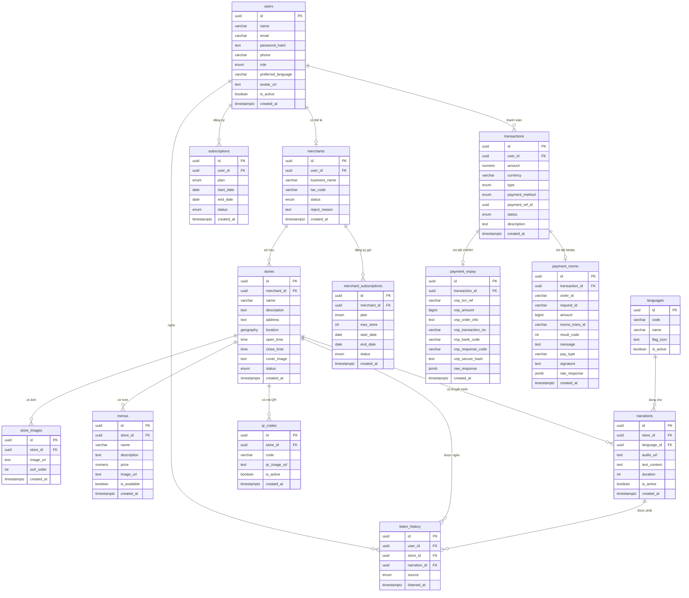

# 📊 Phân Tích Database & Chức Năng Hệ Thống

---

## 1. ERD — Entity Relationship Diagram

---

## 2. Đánh Giá Tích Hợp VNPAY & MoMo

### ✅ Những gì đã có (sau khi cập nhật)

| Thành phần               | Trạng thái | Ghi chú |
|--------------------------|-----------|---------|
| Bảng `transactions` trung tâm | ✅ Đã có | Ghi nhận tất cả giao dịch |
| Cột `payment_method` enum | ✅ Đã có | `vnpay`, `momo`, `cash` |
| Bảng `payment_vnpay`     | ✅ Mới thêm | Lưu toàn bộ fields VNPAY SDK |
| Bảng `payment_momo`      | ✅ Mới thêm | Lưu toàn bộ fields MoMo OpenAPI |
| Chữ ký bảo mật (hash)    | ✅ Đã có | `vnp_secure_hash` / `signature` |
| Lưu raw JSON response    | ✅ Đã có | Cột `raw_response jsonb` để debug |
| Trạng thái giao dịch đủ  | ✅ Đã có | `pending → success/failed/refunded` |

### ⚠️ Cần bổ sung khi implement

| Hạng mục | Lưu ý |
|----------|-------|
| **VNPAY IPN URL** | Backend phải expose endpoint nhận IPN từ VNPAY sau khi user thanh toán |
| **MoMo IPN / Redirect** | Cần xử lý cả `ipnUrl` (server-to-server) và `redirectUrl` (deep link app) |
| **Idempotency** | Đảm bảo không tạo duplicate transaction khi VNPAY/MoMo gọi IPN nhiều lần |
| **Refund flow** | Thêm bảng `refunds` nếu cần xử lý hoàn tiền tự động |
| **Webhook log** | Dùng cột `raw_response jsonb` để lưu toàn bộ payload phục vụ audit |
| **Môi trường Sandbox** | Cần biến môi trường riêng: `VNPAY_SANDBOX_URL`, `MOMO_ENV=sandbox` |

---

## 3. Chức Năng Còn Thiếu Trong Database

### 🟡 Nên bổ sung

| Chức năng | Bảng/Cột cần thêm | Ưu tiên |
|-----------|-------------------|---------| 
| **Đánh giá / Review quán** | Bảng `reviews` (user_id, store_id, rating, comment) | Trung bình |
| **Yêu thích quán** | Bảng `favorites` (user_id, store_id) | Thấp |
| **Thông báo push** | Bảng `notifications` (user_id, title, body, is_read) | Cao |
| **Lịch sử duyệt của Admin** | Bảng `approval_logs` (admin_id, entity_type, entity_id, action) | Trung bình |
| **Danh mục quán** | Bảng `categories` + cột `category_id` trong `stores` | Thấp |
| **Trạng thái merchant bị block** | Thêm `'blocked'` vào enum `merchants.status` | Cao |
| **Refresh token** | Bảng `refresh_tokens` (user_id, token_hash, expires_at) | Cao |

---

## 4. Danh Sách Chức Năng Giao Diện (UI Features)

---

### 📱 A. Mobile App (User — Khách du lịch)

#### 🔐 Xác thực
- [ ] Màn hình Splash / Giới thiệu (onboarding)
- [ ] Đăng ký tài khoản (email + password)
- [ ] Đăng nhập (email / Google / Apple)
- [ ] Quên mật khẩu (reset qua email)
- [ ] Chọn ngôn ngữ yêu thích lúc đầu

#### 🗺️ Khám phá
- [ ] Màn hình bản đồ chính (Map View với marker các quán)
- [ ] Danh sách quán gần đó (List View)
- [ ] Tìm kiếm quán theo tên / địa chỉ
- [ ] Lọc quán theo danh mục / khoảng cách
- [ ] Popup thông báo khi đến gần quán (< 20m)

#### 🏪 Chi tiết quán
- [ ] Trang chi tiết quán (ảnh, mô tả, giờ mở cửa)
- [ ] Bộ ảnh gallery quán
- [ ] Danh sách menu món ăn + giá
- [ ] Nút **Phát thuyết minh** (Play Narration)
- [ ] Chọn ngôn ngữ thuyết minh
- [ ] Player audio (Play / Pause / Seek bar / tốc độ)
- [ ] Nút **Yêu thích** quán (bookmark)

#### 📷 QR & GPS
- [ ] Màn hình quét QR (camera scanner)
- [ ] Xử lý khi GPS kém → gợi ý quét QR

#### 👤 Hồ sơ cá nhân
- [ ] Xem & chỉnh sửa hồ sơ (tên, avatar, SĐT)
- [ ] Lịch sử nghe (danh sách quán đã nghe)
- [ ] Danh sách quán yêu thích
- [ ] Cài đặt ngôn ngữ / thông báo

#### 💳 Thanh toán Premium
- [ ] Màn hình giới thiệu gói Premium (so sánh free vs premium)
- [ ] Chọn gói (Monthly / Yearly)
- [ ] Màn hình thanh toán VNPAY (webview redirect)
- [ ] Màn hình thanh toán MoMo (deeplink / webview)
- [ ] Màn hình kết quả thanh toán (thành công / thất bại)
- [ ] Lịch sử giao dịch

---

### 🖥️ B. Web Dashboard — Merchant (Chủ quán)

#### 🔐 Xác thực
- [ ] Đăng ký tài khoản Merchant (form + thông tin doanh nghiệp)
- [ ] Đăng nhập
- [ ] Trang chờ duyệt (pending approval)

#### 📊 Tổng quan
- [ ] Dashboard tổng quan (lượt nghe, top món, top ngôn ngữ)
- [ ] Biểu đồ lượt nghe theo thời gian
- [ ] Thông báo trạng thái quán

#### 🏪 Quản lý quán
- [ ] Danh sách quán của mình
- [ ] Tạo quán mới (form + chọn vị trí trên bản đồ)
- [ ] Chỉnh sửa thông tin quán
- [ ] Upload / quản lý ảnh quán (kéo thả, sắp xếp thứ tự)
- [ ] Xem trạng thái duyệt của quán

#### 🍜 Quản lý menu
- [ ] Danh sách món ăn
- [ ] Thêm / sửa / xóa món ăn
- [ ] Upload ảnh món ăn
- [ ] Bật/tắt món (còn bán / hết)

#### 🎙️ Quản lý Narration
- [ ] Danh sách narration theo ngôn ngữ
- [ ] Thêm narration (upload audio HOẶC nhập text TTS)
- [ ] Nghe preview audio
- [ ] Sửa / xóa narration

#### 📱 Mã QR
- [ ] Xem mã QR của từng quán
- [ ] Tải về ảnh QR để in

#### 💳 Gói đăng ký
- [ ] Xem gói hiện tại đang dùng
- [ ] Nâng cấp gói (thanh toán VNPAY / MoMo)
- [ ] Lịch sử thanh toán

---

### 🖥️ C. Web Dashboard — Admin (Quản trị viên)

#### 🔐 Xác thực
- [ ] Đăng nhập Admin (tài khoản nội bộ)

#### 📊 Tổng quan hệ thống
- [x] Dashboard: tổng users, merchants, stores, lượt nghe
- [x] Biểu đồ tăng trưởng theo thời gian
- [x] Top quán được nghe nhiều nhất (Top POI, Top Merchant, Top Khách Hàng)

#### 👥 Quản lý User
- [ ] Danh sách users (tìm kiếm, lọc theo role)
- [ ] Xem chi tiết user (lịch sử nghe, subscription)
- [ ] Kích hoạt / Vô hiệu hóa tài khoản

#### 🏢 Quản lý Merchant
- [ ] Danh sách Merchant (lọc theo status: pending / approved / rejected)
- [ ] Xem chi tiết / Approve / Reject merchant
- [ ] Nhập lý do từ chối

#### 🏪 Quản lý Store
- [ ] Danh sách Store (lọc theo status: pending / active / hidden)
- [ ] Xem chi tiết store (ảnh, menu, narration)
- [ ] Approve / Ẩn store

#### 🎙️ Quản lý Narration
- [ ] Danh sách narration toàn hệ thống
- [ ] Nghe preview
- [ ] Edit / Delete / Hide narration vi phạm

#### 💰 Quản lý Giao dịch
- [ ] Danh sách tất cả giao dịch (lọc theo status, phương thức)
- [ ] Xem chi tiết VNPAY / MoMo callback
- [ ] Thống kê doanh thu theo kỳ

#### 🌐 Quản lý Ngôn ngữ
- [ ] Danh sách ngôn ngữ hỗ trợ
- [ ] Thêm / Ẩn ngôn ngữ

---

## 5. Tóm Tắt Đánh Giá

| Hạng mục | Đánh giá |
|----------|----------|
| Database schema cơ bản | ✅ Đủ cho MVP |
| Tích hợp VNPAY | ✅ Đã có bảng đủ fields |
| Tích hợp MoMo | ✅ Đã có bảng đủ fields |
| Hỗ trợ đa ngôn ngữ | ✅ Hoàn chỉnh |
| GPS & QR fallback | ✅ Hoàn chỉnh |
| Analytics merchant | ✅ Có qua `listen_history` |
| Review / Rating | ⚠️ Chưa có bảng |
| Push Notification | ⚠️ Chưa có bảng |
| Refresh Token / Auth | ⚠️ Cần bảng `refresh_tokens` |
| Audit Log Admin | ⚠️ Nên có `approval_logs` |

> **Kết luận:** Schema hiện tại đã **đủ để triển khai MVP** với đầy đủ tính năng thanh toán VNPAY + MoMo. Các hạng mục ⚠️ nên bổ sung trước khi ra production.

---

*Tài liệu này được duy trì bởi nhóm phát triển dự án Seminar SGU.*
*Cập nhật lần cuối: 2026-03-16*
