# 📐 Diagrams — Vĩnh Khánh Audio Guide

> Tất cả sơ đồ sử dụng **Mermaid.js** — render được trực tiếp trên GitHub, GitLab, Notion, VSCode.

---

## 📊 ERD — Entity Relationship Diagram

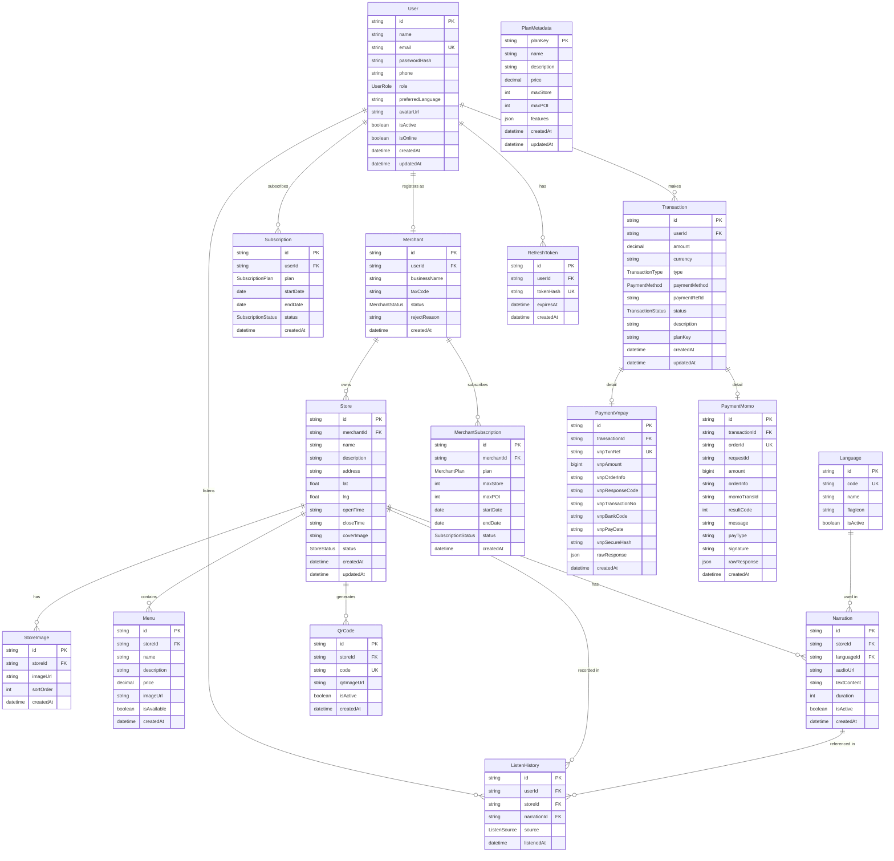

---

## 🔄 Sequence Diagrams

### SEQ-01: Đăng ký và Đăng nhập (User)

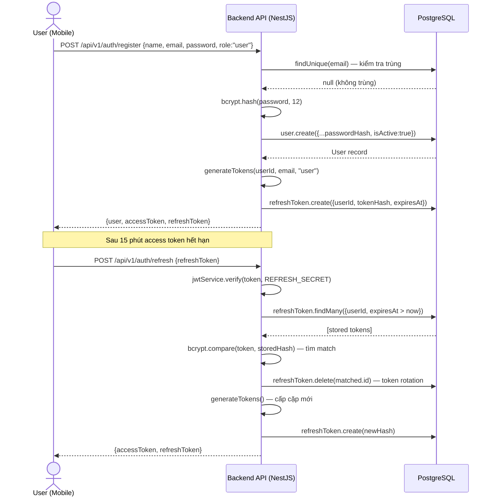

---

### SEQ-02: Đăng ký Merchant (Chờ duyệt)

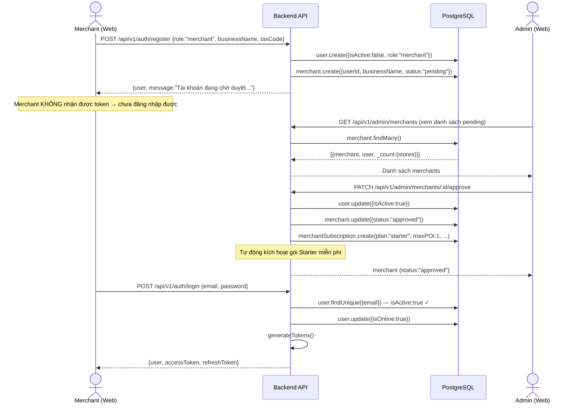

---

### SEQ-03: GPS Geofencing → Auto-Narration (Mobile App)

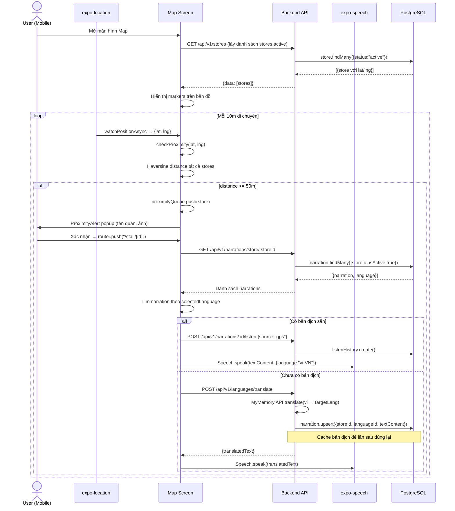

---

### SEQ-04: QR Scanner → Narration

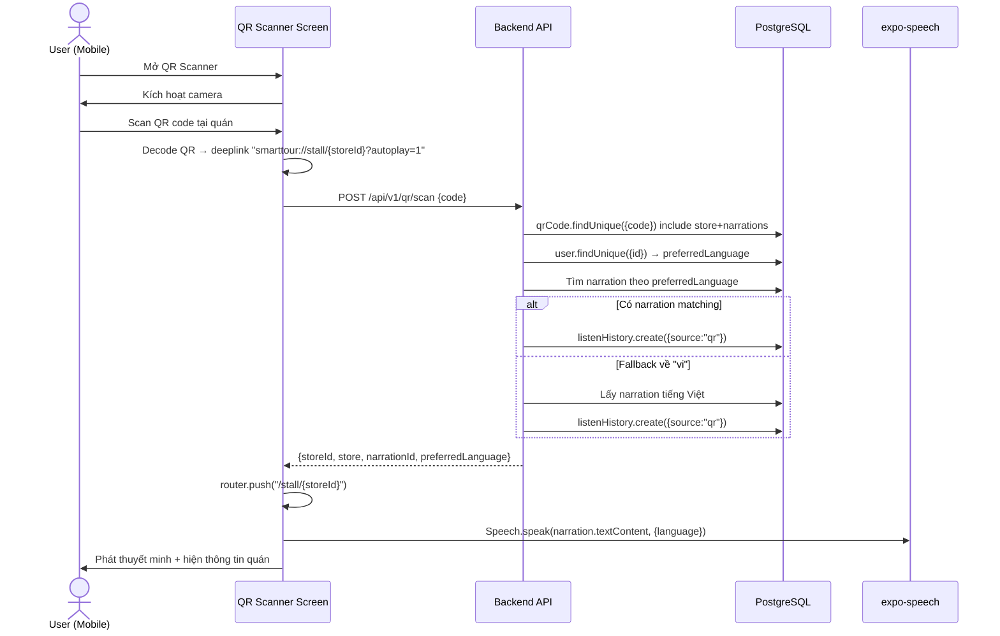

---

### SEQ-05: Upload Narration + Auto-Translate (Merchant)

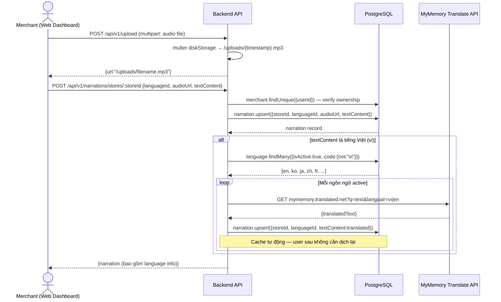

---

### SEQ-06: Thanh toán VNPAY (User mua gói Premium)

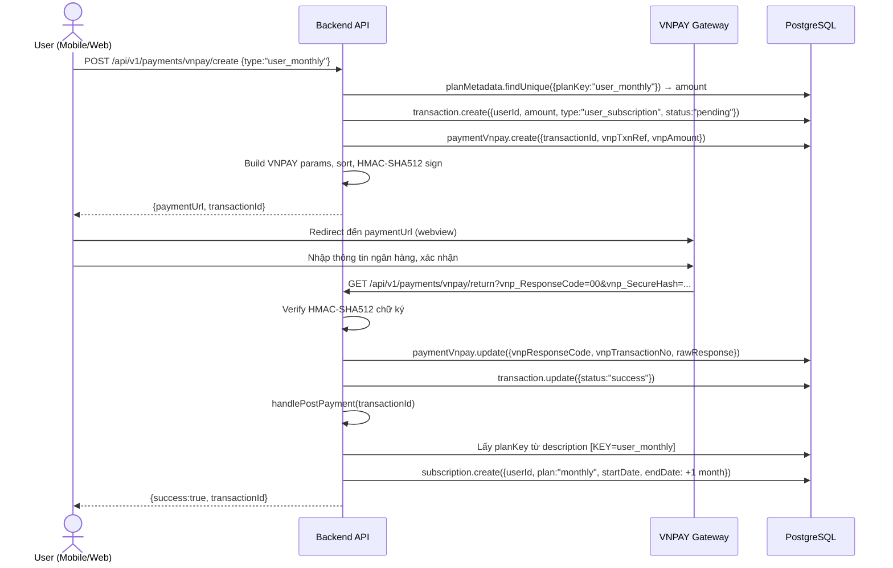

---

### SEQ-07: Thanh toán MoMo (Merchant mua gói Business)

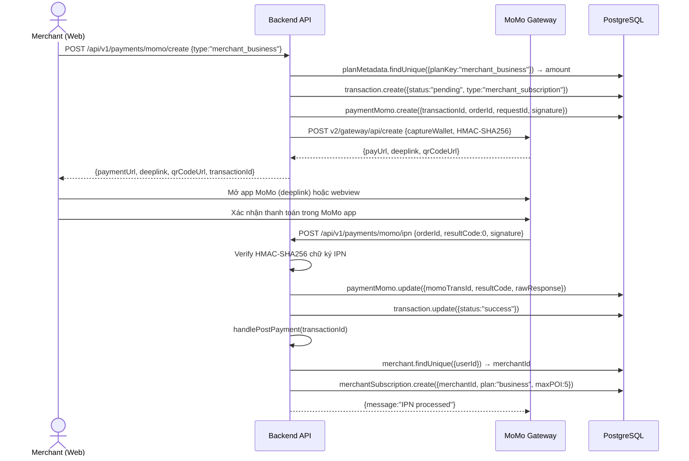

---

### SEQ-08: Admin Dashboard — System Stats

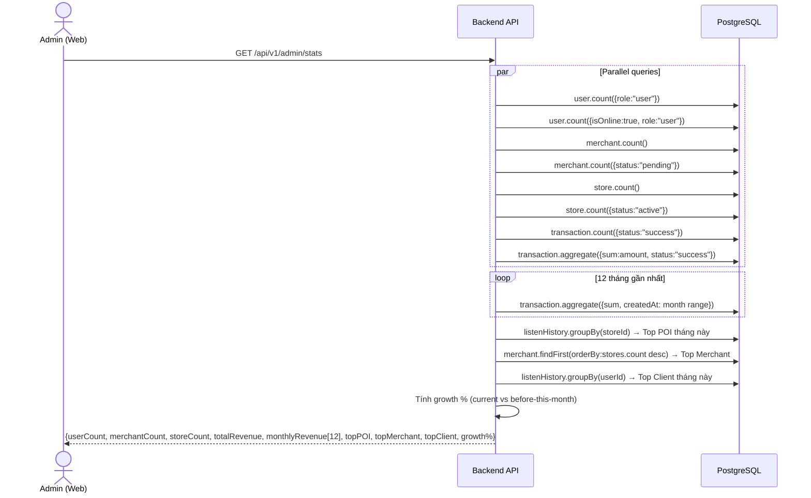

---

### SEQ-09: Merchant — Tạo Store (với giới hạn POI theo gói)

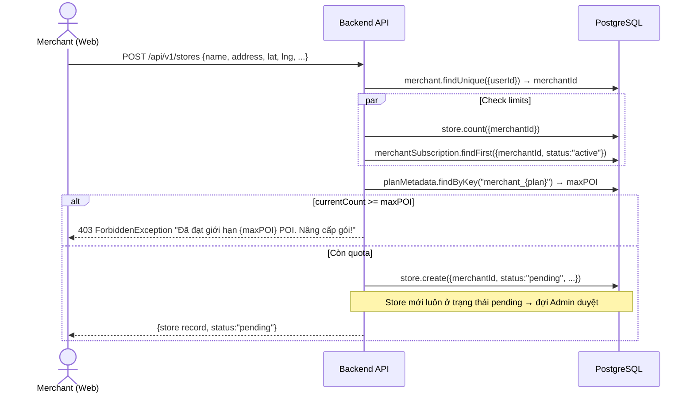

---

### SEQ-10: Logout và Revoke Token

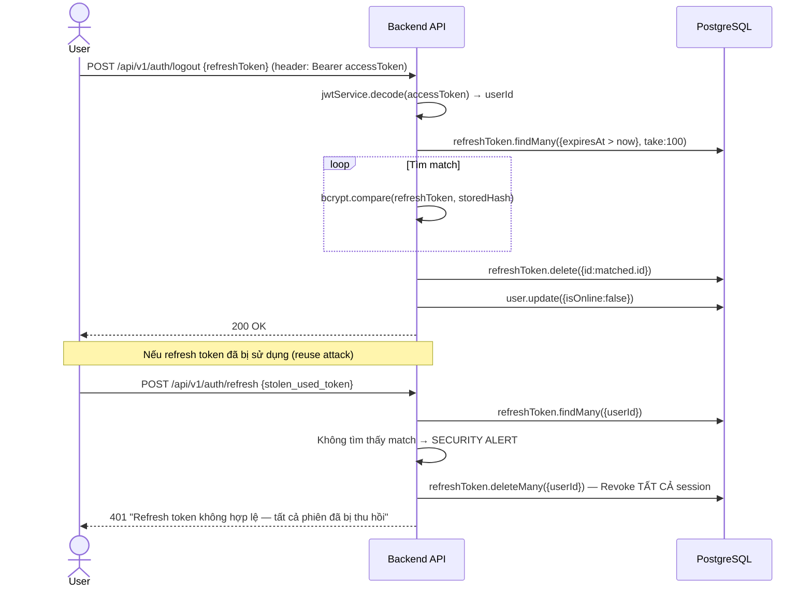

---

## 📊 Activity Diagrams

### ACT-01: Luồng nghe thuyết minh theo GPS

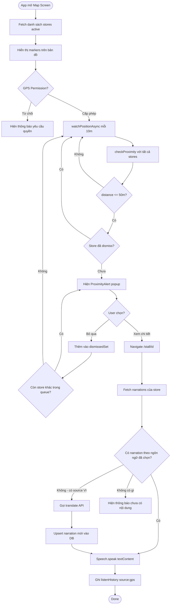

---

### ACT-02: Luồng Merchant đăng ký và được duyệt

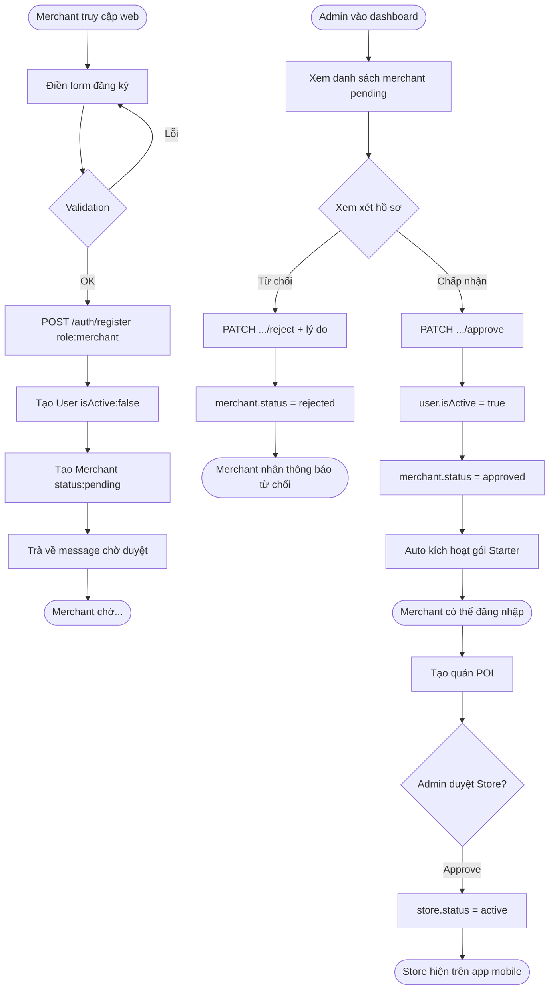

---

### ACT-03: Luồng thanh toán và kích hoạt gói

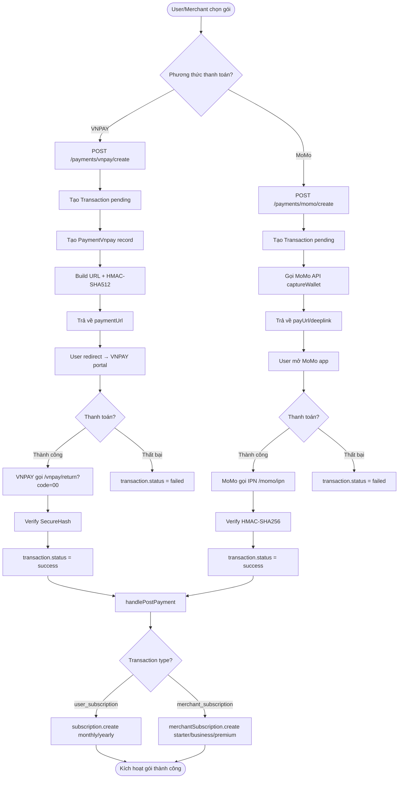

---

*Cập nhật lần cuối: 2026-05-09 — Phản ánh đúng implementation thực tế*
