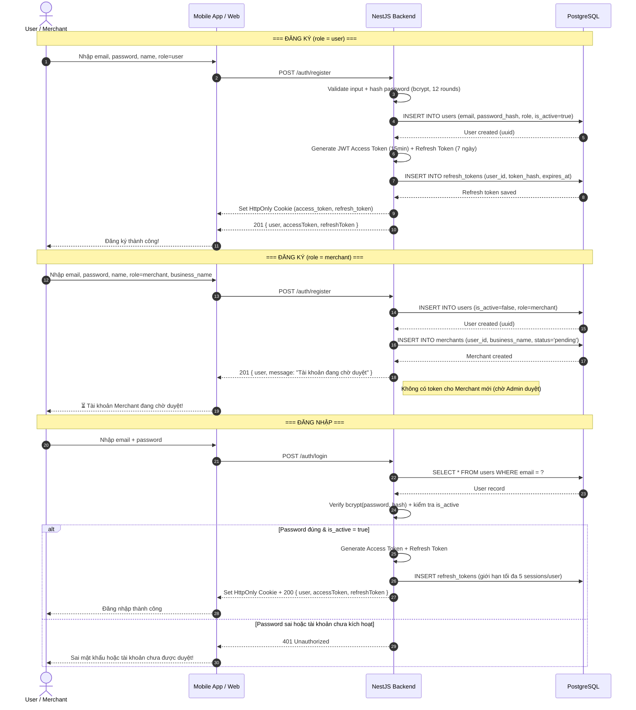
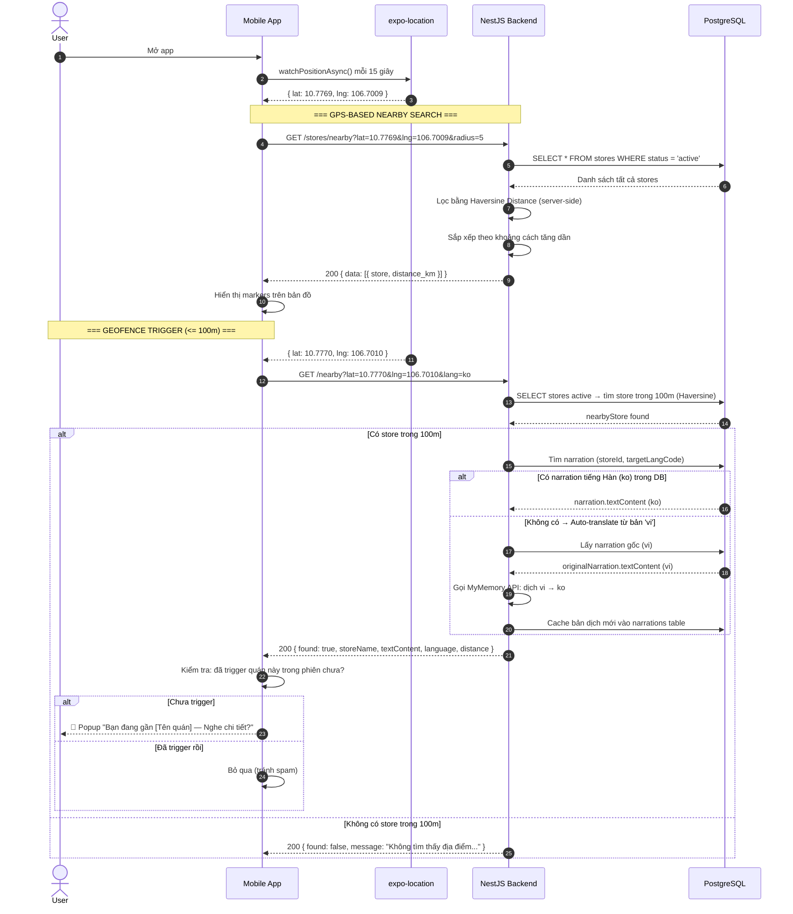
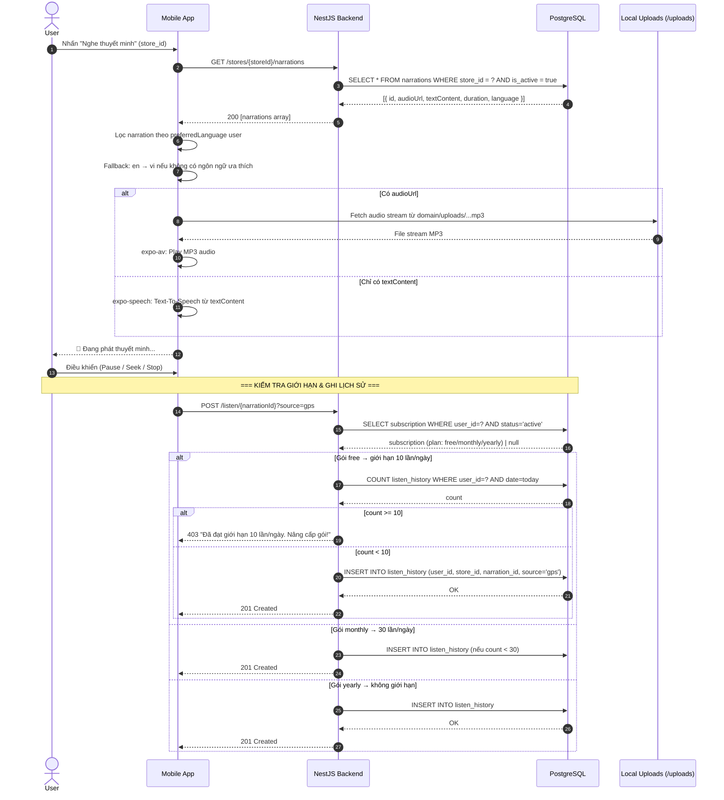
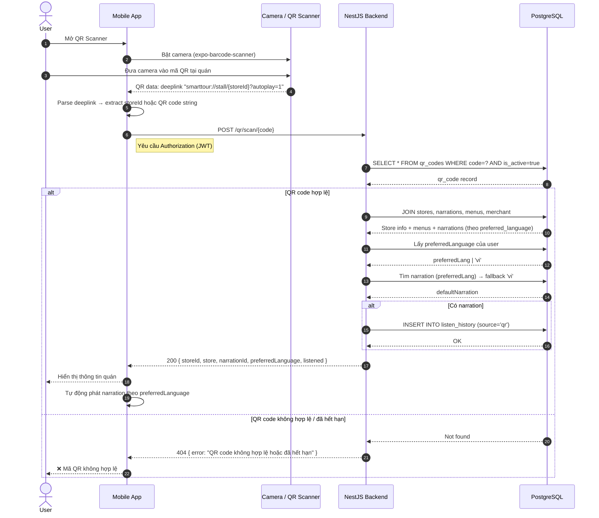
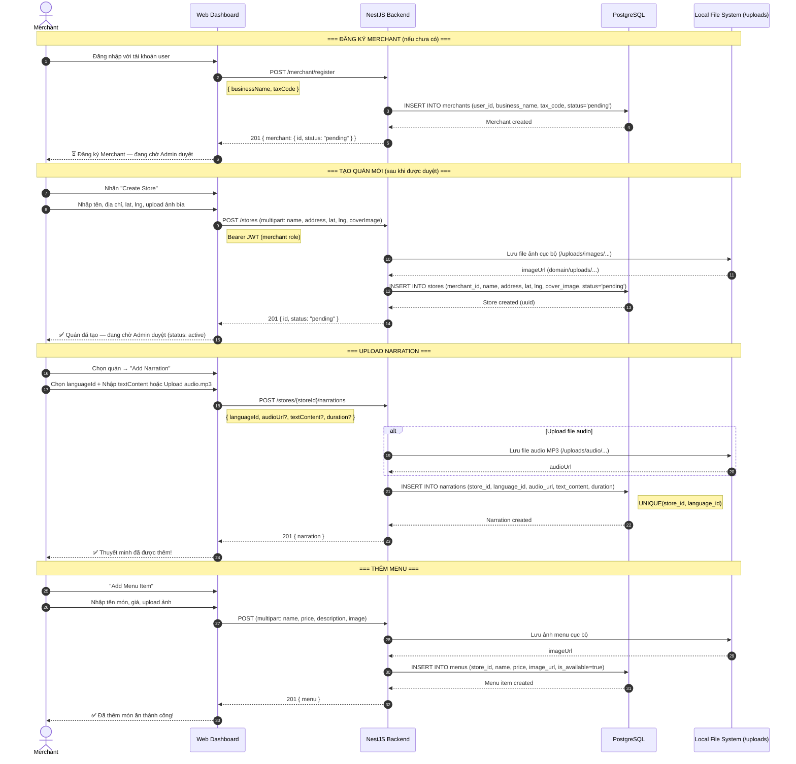
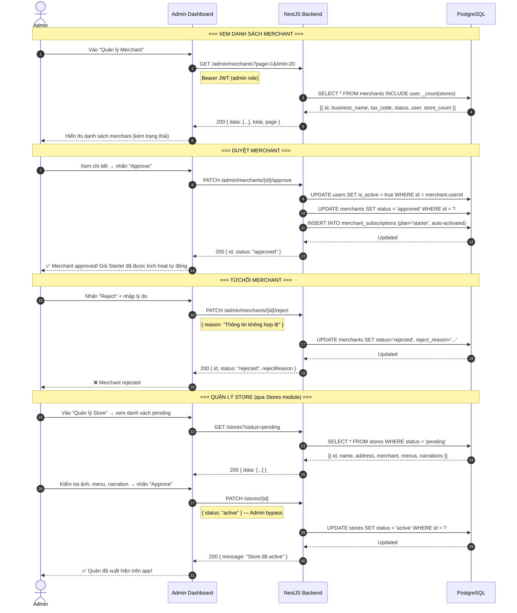
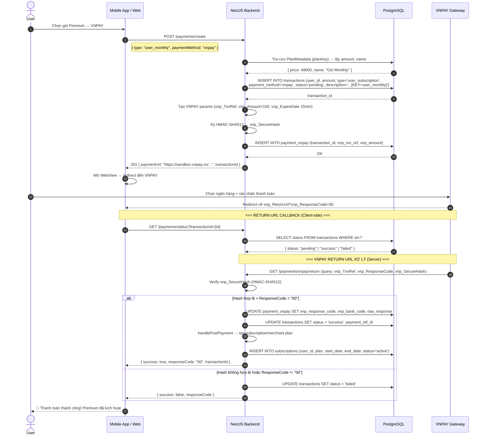
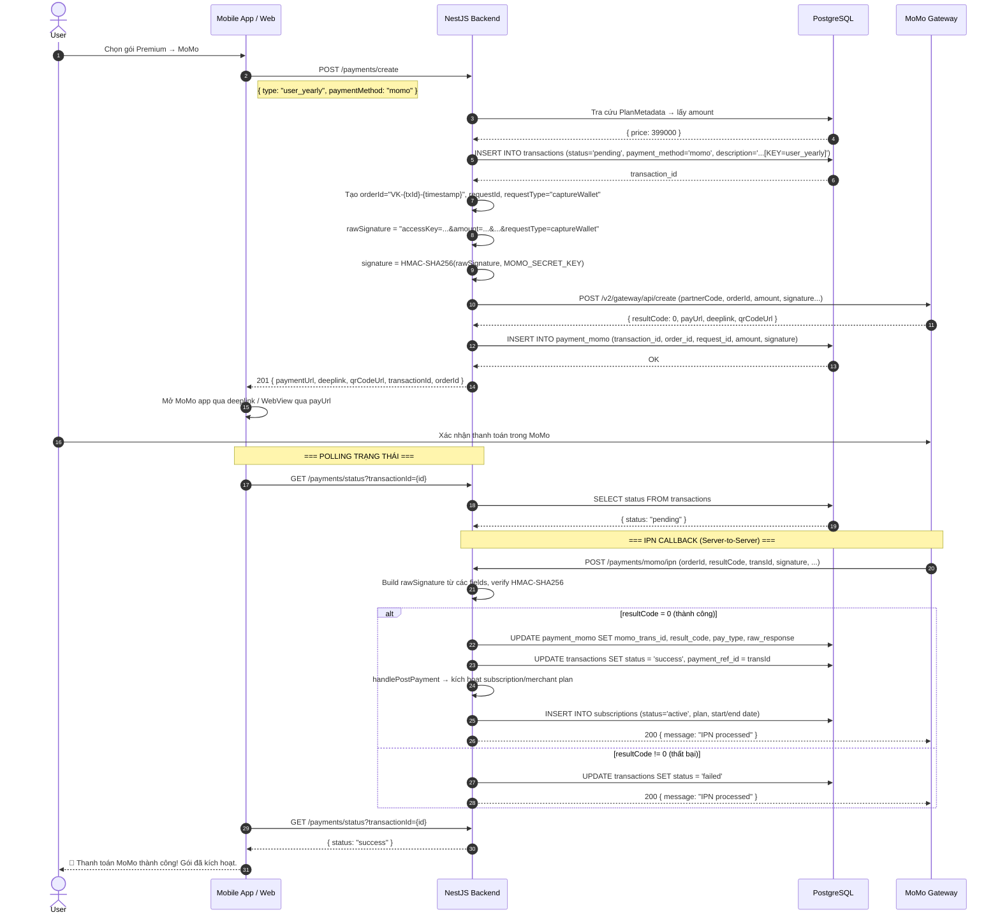
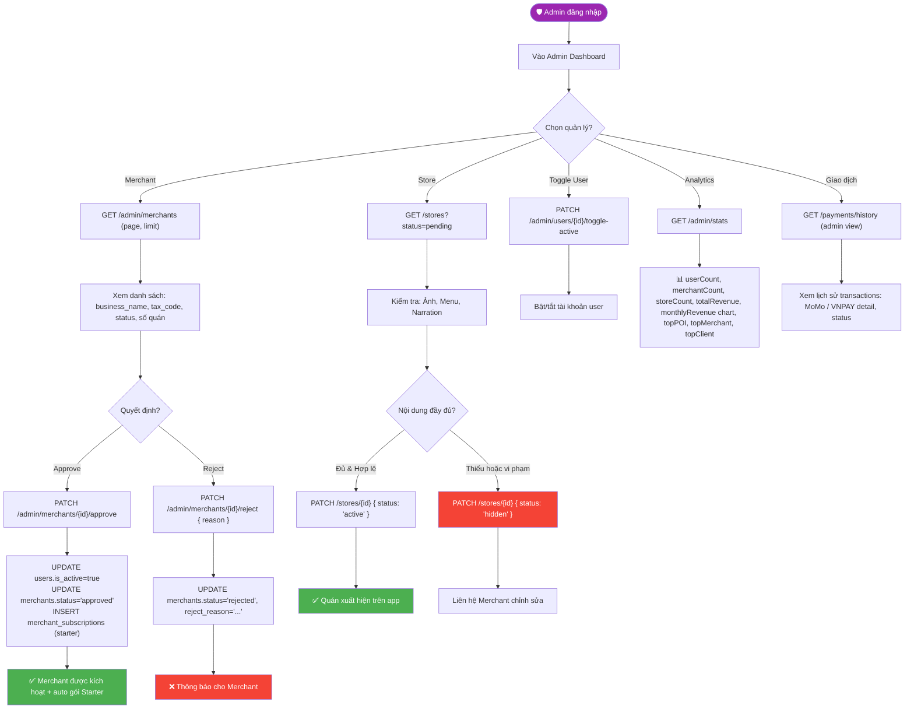
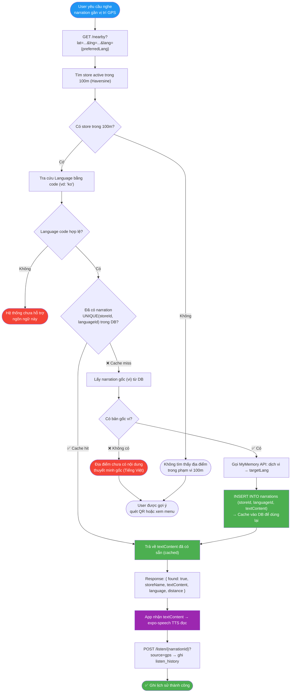

# 📐 SEQUENCE DIAGRAM & ACTIVITY DIAGRAM
# VĨNH KHÁNH DIGITAL AUDIO GUIDE

**Ngày cập nhật:** 18/04/2026  
**Công cụ vẽ:** Mermaid.js

---

## MỤC LỤC

### Sequence Diagrams
1. [SD1 — Đăng ký & Đăng nhập](#sd1--đăng-ký--đăng-nhập)
2. [SD2 — Tìm quán gần đó (GPS + Haversine)](#sd2--tìm-quán-gần-đó-gps--haversine)
3. [SD3 — Nghe Audio Narration](#sd3--nghe-audio-narration)
4. [SD4 — Quét QR Code](#sd4--quét-qr-code)
5. [SD5 — Merchant tạo quán & Upload Narration](#sd5--merchant-tạo-quán--upload-narration)
6. [SD6 — Admin duyệt Merchant](#sd6--admin-duyệt-merchant)
7. [SD7 — Thanh toán VNPAY](#sd7--thanh-toán-vnpay)
8. [SD8 — Thanh toán MoMo](#sd8--thanh-toán-momo)

### Activity Diagrams
1. [AD1 — Luồng User khám phá quán](#ad1--luồng-user-khám-phá-quán)
2. [AD2 — Luồng Merchant đăng ký & tạo quán](#ad2--luồng-merchant-đăng-ký--tạo-quán)
3. [AD3 — Luồng Admin duyệt](#ad3--luồng-admin-duyệt)
4. [AD4 — Luồng thanh toán tổng quát](#ad4--luồng-thanh-toán-tổng-quát)
5. [AD5 — Luồng Narration Fallback đa ngôn ngữ](#ad5--luồng-narration-fallback-đa-ngôn-ngữ)

---

## SEQUENCE DIAGRAMS

---

### SD1 — Đăng ký & Đăng nhập



---

### SD2 — Tìm quán gần đó (GPS + Haversine)



---

### SD3 — Nghe Audio Narration



---

### SD4 — Quét QR Code



---

### SD5 — Merchant tạo quán & Upload Narration



---

### SD6 — Admin duyệt Merchant



---

### SD7 — Thanh toán VNPAY



---

### SD8 — Thanh toán MoMo



---

## ACTIVITY DIAGRAMS

---

### AD1 — Luồng User khám phá quán

```mermaid
flowchart TD
    A([🧳 User mở app]) --> B{Đã đăng nhập?}

    B -->|Chưa| C[Đăng nhập / Đăng ký]
    C --> D[Chọn ngôn ngữ yêu thích]
    D --> E[Cho phép truy cập GPS]

    B -->|Rồi| E

    E --> F{GPS khả dụng?}

    F -->|Có| G[App lấy tọa độ GPS hiện tại]
    G --> H["GET /stores/nearby?lat=...&lng=...&radius=5"]
    H --> I[API: Haversine filter server-side]
    I --> J[Hiển thị quán trên bản đồ]

    F -->|Không| K[Hiển thị gợi ý: Quét QR Code]
    K --> L[Mở Camera QR Scanner]
    L --> M[Scan mã QR tại quán]
    M --> N{QR hợp lệ?}
    N -->|Có| O["POST /qr/scan/{code} → trả về store + narration"]
    N -->|Không| P[❌ Thông báo lỗi]
    P --> L

    J --> Q{"Khoảng cách <= 100m?"}

    Q -->|Chưa| R[User tiếp tục di chuyển]
    R --> G

    Q -->|Có| S["GET /nearby?lat=...&lng=...&lang={preferredLang}"]
    S --> T{Có narration?}
    T -->|Có (cached)| U[Trả về textContent đã dịch]
    T -->|Không có → Auto-translate vi→lang| V[MyMemory API dịch → cache vào DB]
    V --> U
    T -->|Không có bản gốc vi| W[❌ Thông báo: Chưa có thuyết minh]

    U --> X[📍 Popup "Bạn đang gần [Tên quán]"]
    X --> Y{User chọn hành động?}

    Y -->|Nghe thuyết minh| Z["GET /stores/{storeId}/narrations"]
    Z --> AA{Có audioUrl?}
    AA -->|Có| AB[expo-av: Play MP3]
    AA -->|Chỉ text| AC[expo-speech: Text-To-Speech]
    AB --> AD["POST /listen/{narrationId}?source=gps"]
    AC --> AD
    AD --> AE[Kiểm tra subscription limit: free=10, monthly=30, yearly=∞]
    AE --> AF([✅ Ghi lịch sử | 403 Hết giới hạn])

    Y -->|Xem menu| AG["GET /stores/{storeId} → menus"]
    AG --> AH[Hiển thị danh sách món ăn + giá]
    Y -->|Bỏ qua| R

    O --> Z

    style A fill:#4CAF50,color:#fff
    style AF fill:#4CAF50,color:#fff
    style X fill:#FF9800,color:#fff
    style AB fill:#2196F3,color:#fff
    style P fill:#f44336,color:#fff
    style W fill:#f44336,color:#fff
```

---

### AD2 — Luồng Merchant đăng ký & tạo quán

```mermaid
flowchart TD
    A([🍜 Merchant truy cập web]) --> B{Có tài khoản user?}

    B -->|Chưa| C[Đăng ký tài khoản role=user]
    C --> REG[Đăng nhập vào dashboard]
    REG --> D

    B -->|Có| D["POST /merchant/register (businessName, taxCode)"]
    D --> E["merchants.status = 'pending', users.is_active = false"]
    E --> F[⏳ Chờ Admin duyệt]

    F -->|Admin Approve| G["merchants.status='approved'\nusers.is_active=true\nmarchant_subscriptions: plan='starter'"]
    G --> H[✅ Vào Merchant Dashboard]

    F -->|Admin Reject| I[❌ Xem lý do từ chối: rejectReason]
    I --> J{Muốn đăng ký lại?}
    J -->|Có| D
    J -->|Không| K([Kết thúc])

    H --> L{Chọn chức năng?}

    L -->|Tạo quán mới| M[Nhập thông tin quán: Tên, địa chỉ, GPS, ảnh bìa]
    M --> N["POST /stores (multipart)"]
    N --> O["stores.status = 'pending'"]
    O --> P[⏳ Chờ Admin duyệt quán]
    P -->|Admin PATCH /stores/{id} → active| Q["✅ stores.status = 'active'\nQuán live trên app!"]

    L -->|Upload Narration| R["POST /stores/{storeId}/narrations"]
    R --> S{Upload audio hay text?}
    S -->|Upload MP3| T[Lưu vào /uploads/audio/ (Local FS)]
    S -->|Nhập text| U[textContent lưu vào DB, TTS do client đọc]
    T --> V[Lưu narrations record (UNIQUE: store_id + language_id)]
    U --> V

    L -->|Quản lý Menu| W[Thêm / Sửa / Xóa món ăn]
    L -->|Xem Analytics| X[Xem listen_history của quán mình]
    L -->|QR Code| Y["POST /qr/store/{storeId} → Tạo QR mới (vô hiệu hóa QR cũ)"]

    Q --> Z([✅ Merchant setup hoàn tất])

    style A fill:#FF9800,color:#fff
    style H fill:#4CAF50,color:#fff
    style Q fill:#4CAF50,color:#fff
    style I fill:#f44336,color:#fff
    style F fill:#FFC107,color:#333
```

---

### AD3 — Luồng Admin duyệt



---

### AD4 — Luồng thanh toán tổng quát

```mermaid
flowchart TD
    A([User / Merchant chọn gói]) --> B["POST /payments/create { type, paymentMethod }"]
    B --> C[Tra cứu PlanMetadata để lấy price]
    C --> D["INSERT INTO transactions (status='pending')"]

    D --> E{paymentMethod?}

    E -->|vnpay| F[Tạo VNPAY params + HMAC-SHA512 vnp_SecureHash]
    F --> G[INSERT payment_vnpay]
    G --> H[Trả về paymentUrl → WebView redirect]
    H --> I[User thanh toán tại VNPAY]
    I --> J["VNPAY redirect về /payments/vnpay/return"]
    J --> K{Verify vnp_SecureHash?}

    E -->|momo| L[Tạo MoMo request + HMAC-SHA256 signature]
    L --> M[INSERT payment_momo]
    M --> N[POST tới MoMo API /v2/gateway/api/create]
    N --> O[Trả về payUrl/deeplink → Mở MoMo app]
    O --> P[User xác nhận trong MoMo]
    P --> Q["MoMo gọi POST /payments/momo/ipn"]
    Q --> R{Verify HMAC-SHA256 Signature?}

    K -->|Hợp lệ| S{vnp_ResponseCode = "00"?}
    K -->|Không hợp lệ| T["❌ status = 'failed'"]

    R -->|Hợp lệ| U{resultCode = 0?}
    R -->|Không hợp lệ| T

    S -->|Thành công| V["✅ status = 'success'"]
    S -->|Thất bại| T

    U -->|Thành công| V
    U -->|Thất bại| T

    V --> W[handlePostPayment]
    W --> X{Transaction type?}
    X -->|user_subscription| Y["INSERT INTO subscriptions (plan, start_date, end_date, status='active')"]
    X -->|merchant_subscription| Z["merchantSubscriptionsService.activatePlan(merchant, plan)"]

    Y --> AA[🎉 Thông báo thành công cho user]
    Z --> AA

    T --> AB[Thông báo thất bại]
    AB --> AC{Thử lại?}
    AC -->|Có| A
    AC -->|Không| AD([Kết thúc])

    AA --> AD

    style A fill:#FF9800,color:#fff
    style V fill:#4CAF50,color:#fff
    style T fill:#f44336,color:#fff
    style AA fill:#2196F3,color:#fff
```

---

### AD5 — Luồng Narration Fallback đa ngôn ngữ



---

## TỔNG HỢP DIAGRAMS

| Loại | Mã | Mô tả | Actor chính |
|------|-----|-------|-------------|
| Sequence | SD1 | Đăng ký & Đăng nhập (JWT + Cookie) | User/Merchant |
| Sequence | SD2 | GPS Geofencing + Haversine + Auto-translate | User + API |
| Sequence | SD3 | Nghe Audio Narration + Subscription Limit | User + Storage |
| Sequence | SD4 | Quét QR Code + Auto Listen History | User + Camera |
| Sequence | SD5 | Merchant tạo quán + Upload Narration/Menu | Merchant |
| Sequence | SD6 | Admin duyệt Merchant + Auto Starter Plan | Admin |
| Sequence | SD7 | Thanh toán VNPAY + Return URL Verification | User + VNPAY |
| Sequence | SD8 | Thanh toán MoMo + IPN Callback + Polling | User + MoMo |
| Activity | AD1 | Luồng khám phá quán (GPS + QR) | User |
| Activity | AD2 | Luồng Merchant setup (register → store → narration) | Merchant |
| Activity | AD3 | Luồng Admin duyệt + Stats dashboard | Admin |
| Activity | AD4 | Luồng thanh toán tổng quát (VNPAY + MoMo) | User/Merchant |
| Activity | AD5 | Narration fallback + Auto-translate + Cache | System |

---

*Tài liệu này được duy trì bởi nhóm phát triển dự án Seminar SGU.*  
*Cập nhật lần cuối: 18/04/2026*
