# 📐 SEQUENCE DIAGRAM & ACTIVITY DIAGRAM
# VĨNH KHÁNH DIGITAL AUDIO GUIDE

**Ngày cập nhật:** 18/04/2026  
**Công cụ vẽ:** Mermaid.js

---

## MỤC LỤC

### Sequence Diagrams
1. [SD1 — Đăng ký & Đăng nhập](#sd1--đăng-ký--đăng-nhập)
2. [SD2 — Tìm quán gần đó (GPS + Haversine)](#sd2--tìm-quán-gần-đó-gps--haversine)
3. [SD3 — Nghe Audio Narration](#sd3--nghe-audio-narration)
4. [SD4 — Quét QR Code](#sd4--quét-qr-code)
5. [SD5 — Merchant tạo quán & Upload Narration](#sd5--merchant-tạo-quán--upload-narration)
6. [SD6 — Admin duyệt Merchant](#sd6--admin-duyệt-merchant)
7. [SD7 — Thanh toán VNPAY](#sd7--thanh-toán-vnpay)
8. [SD8 — Thanh toán MoMo](#sd8--thanh-toán-momo)

### Activity Diagrams
1. [AD1 — Luồng User khám phá quán](#ad1--luồng-user-khám-phá-quán)
2. [AD2 — Luồng Merchant đăng ký & tạo quán](#ad2--luồng-merchant-đăng-ký--tạo-quán)
3. [AD3 — Luồng Admin duyệt](#ad3--luồng-admin-duyệt)
4. [AD4 — Luồng thanh toán tổng quát](#ad4--luồng-thanh-toán-tổng-quát)
5. [AD5 — Luồng Narration Fallback đa ngôn ngữ](#ad5--luồng-narration-fallback-đa-ngôn-ngữ)

---

## SEQUENCE DIAGRAMS

> **Lưu ý kiến trúc:** Backend sử dụng **NestJS + Prisma ORM + Dependency Injection**.
> Mọi thao tác DB đều qua `PrismaService` được inject, không có raw SQL trực tiếp.
> Ký hiệu `DB` trong diagram thể hiện lớp Prisma ORM → PostgreSQL.

---

### SD1 — Đăng ký & Đăng nhập

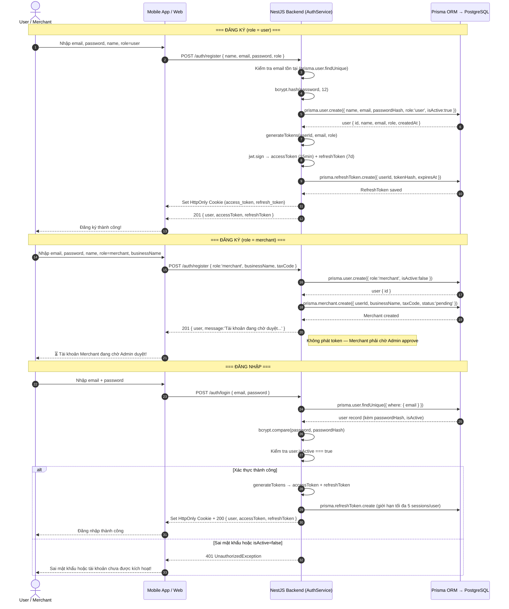

---

### SD2 — Tìm quán gần đó (GPS + Haversine)

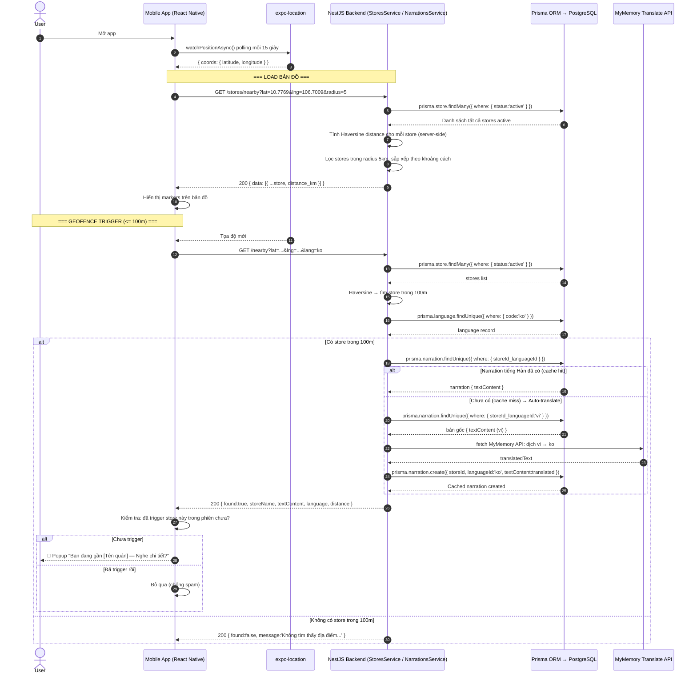

---

### SD3 — Nghe Audio Narration

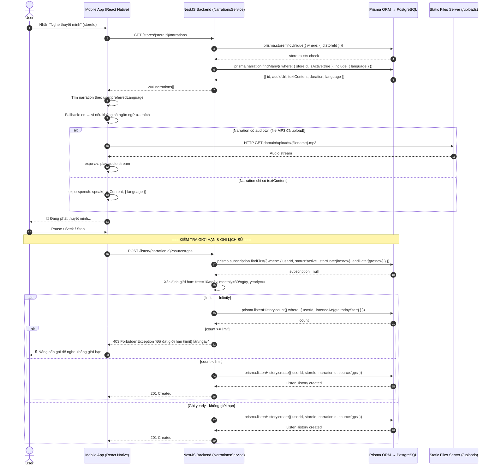

---

### SD4 — Quét QR Code

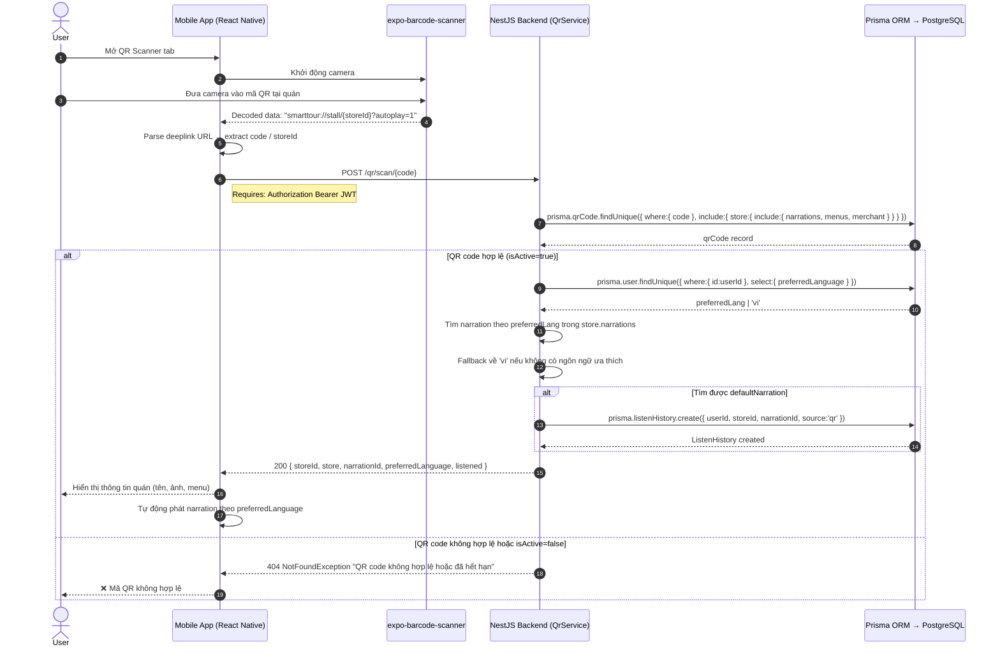

---

### SD5 — Merchant tạo quán & Upload Narration

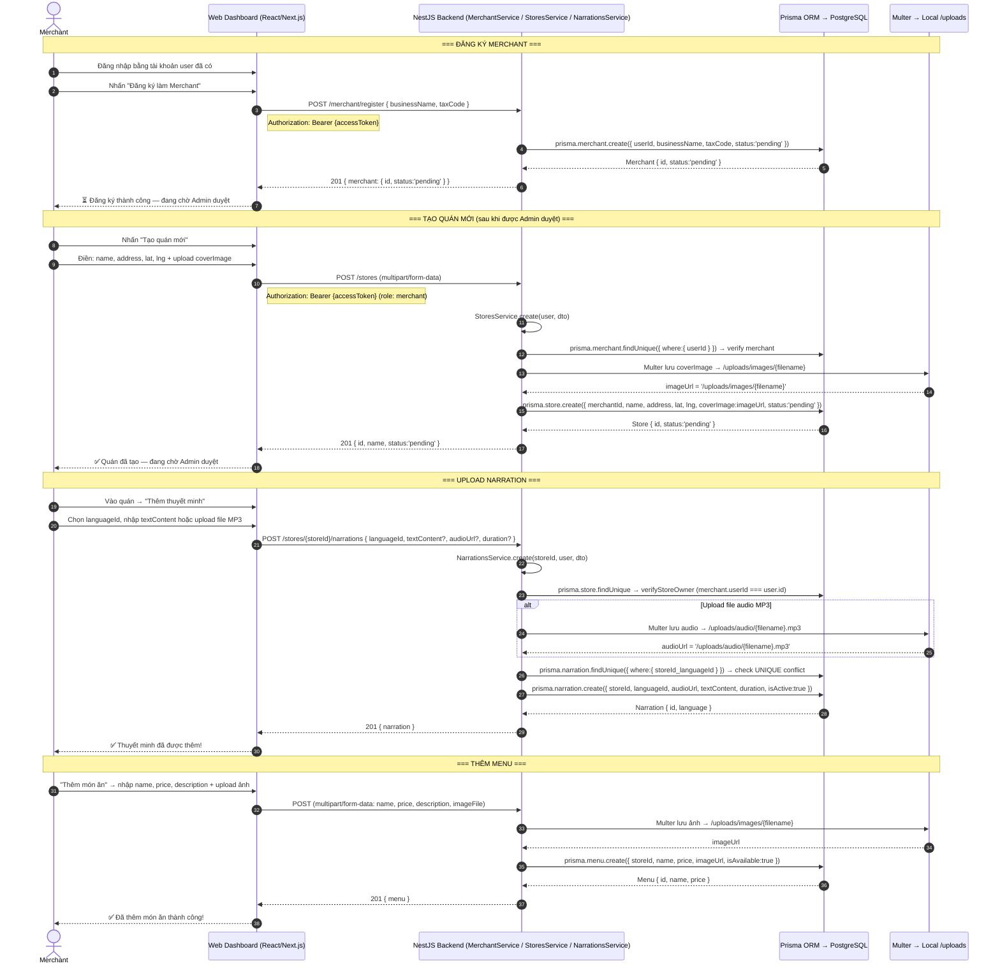

---

### SD6 — Admin duyệt Merchant

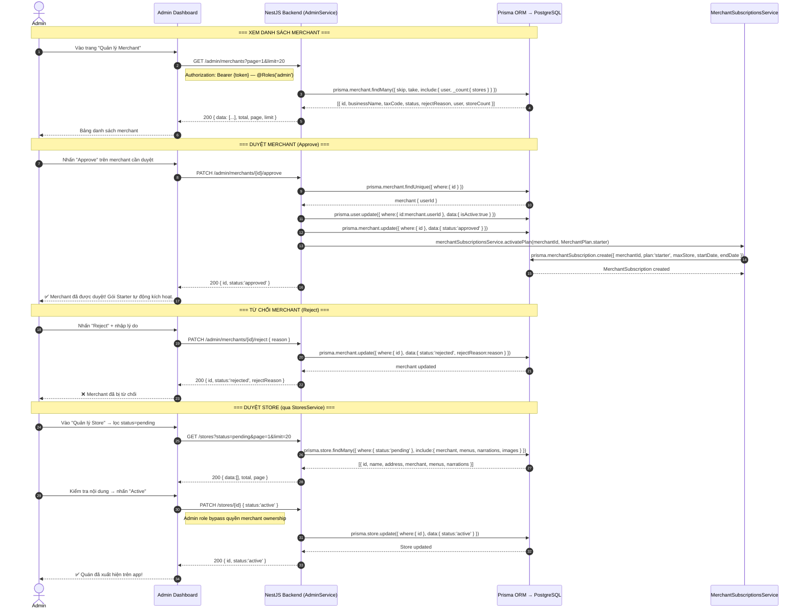

---

### SD7 — Thanh toán VNPAY

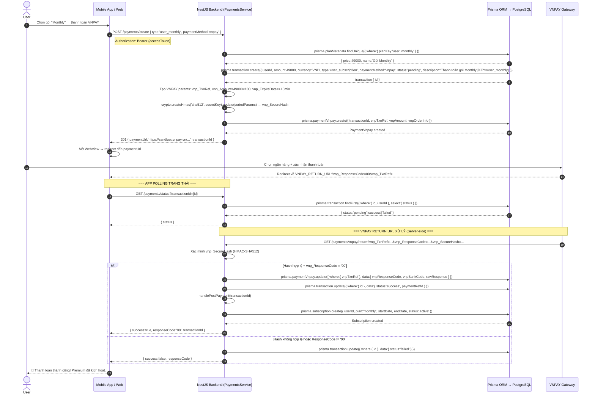

---

### SD8 — Thanh toán MoMo

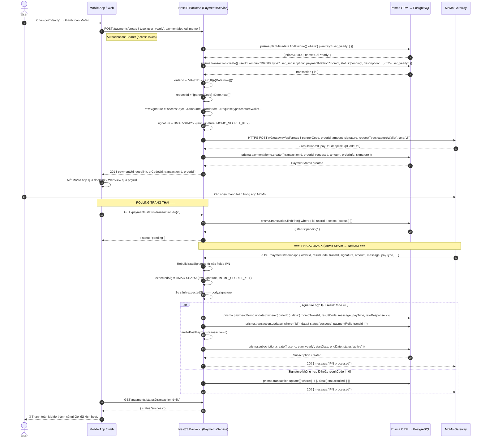

---

## ACTIVITY DIAGRAMS

---

### AD1 — Luồng User khám phá quán

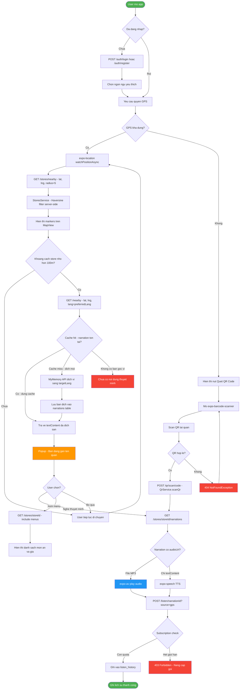

---

### AD2 — Luồng Merchant đăng ký & tạo quán

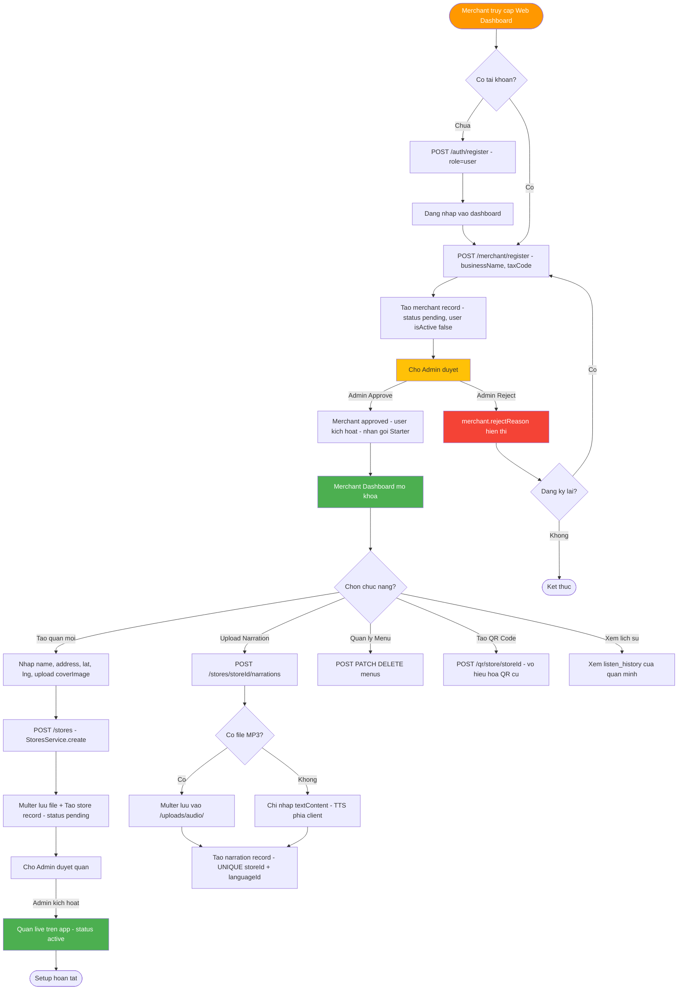

---

### AD3 — Luồng Admin duyệt

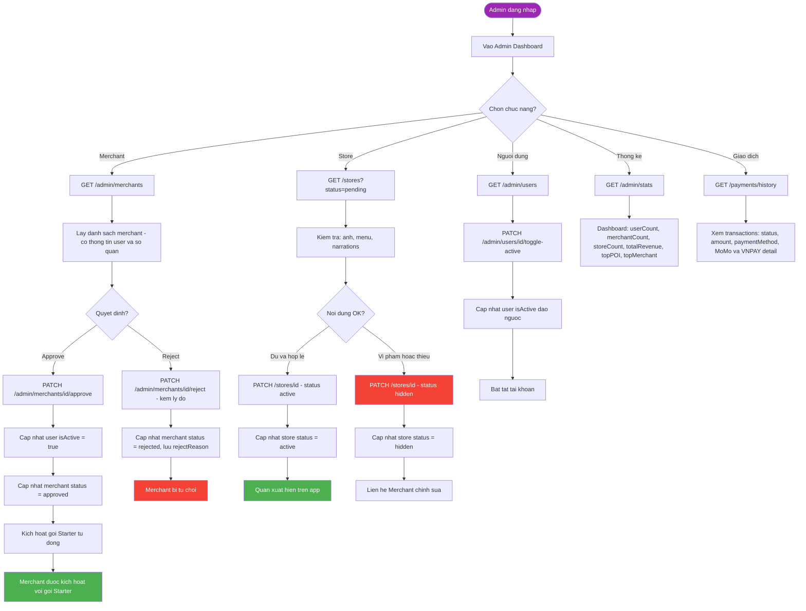

---

### AD4 — Luồng thanh toán tổng quát

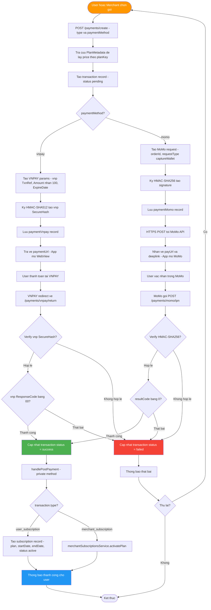

---

### AD5 — Luồng Narration Fallback đa ngôn ngữ

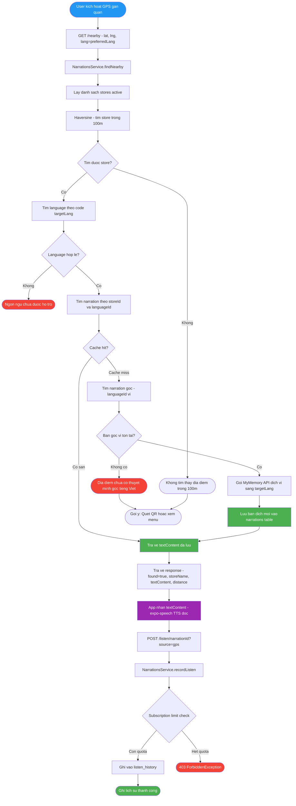

---

## TỔNG HỢP DIAGRAMS

| Loại | Mã | Mô tả | Actor chính |
|------|-----|-------|-------------|
| Sequence | SD1 | Đăng ký & Đăng nhập — JWT Cookie + bcrypt | User / Merchant |
| Sequence | SD2 | GPS Geofencing — Haversine + MyMemory Auto-translate | User + API |
| Sequence | SD3 | Nghe Audio — expo-av/expo-speech + Subscription Limit | User |
| Sequence | SD4 | Quét QR — QrService.scanQr + Auto Listen History | User + Camera |
| Sequence | SD5 | Merchant setup — Multer upload + Prisma store/narration | Merchant |
| Sequence | SD6 | Admin duyệt — approve/reject + Auto Starter Plan | Admin |
| Sequence | SD7 | Thanh toán VNPAY — HMAC-SHA512 + Return URL | User + VNPAY |
| Sequence | SD8 | Thanh toán MoMo — HMAC-SHA256 + IPN Callback | User + MoMo |
| Activity | AD1 | Khám phá quán — GPS → Map → Narration → Listen | User |
| Activity | AD2 | Merchant setup — register → store → narration → QR | Merchant |
| Activity | AD3 | Admin quản lý — merchant/store/user/stats/transactions | Admin |
| Activity | AD4 | Thanh toán tổng quát — VNPAY & MoMo unified flow | User / Merchant |
| Activity | AD5 | Narration multilingual — cache hit/miss + auto-translate | System |

---

*Tài liệu này được duy trì bởi nhóm phát triển dự án Seminar SGU.*  
*Cập nhật lần cuối: 18/04/2026*
