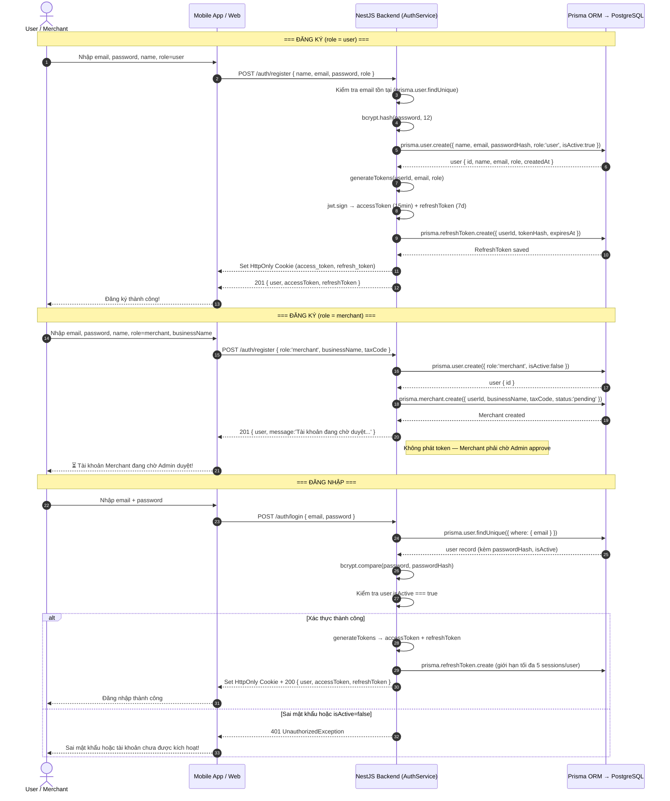
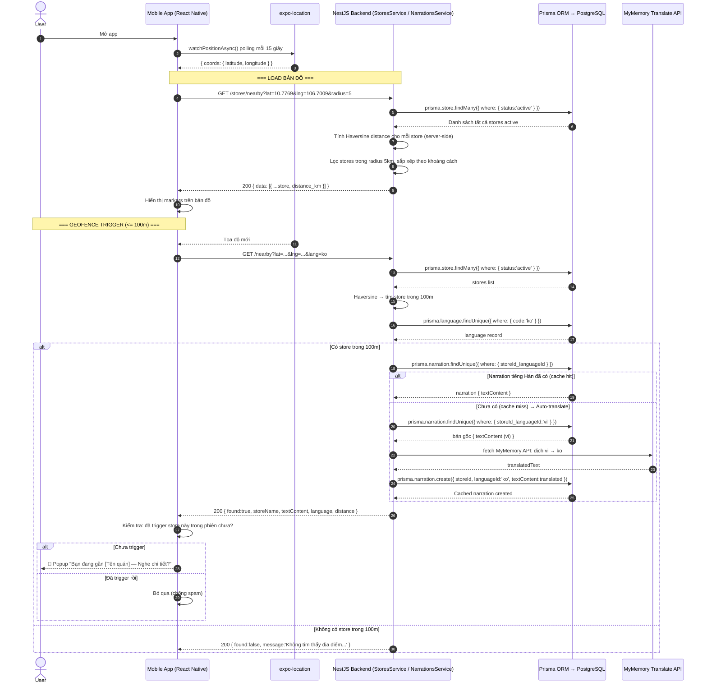
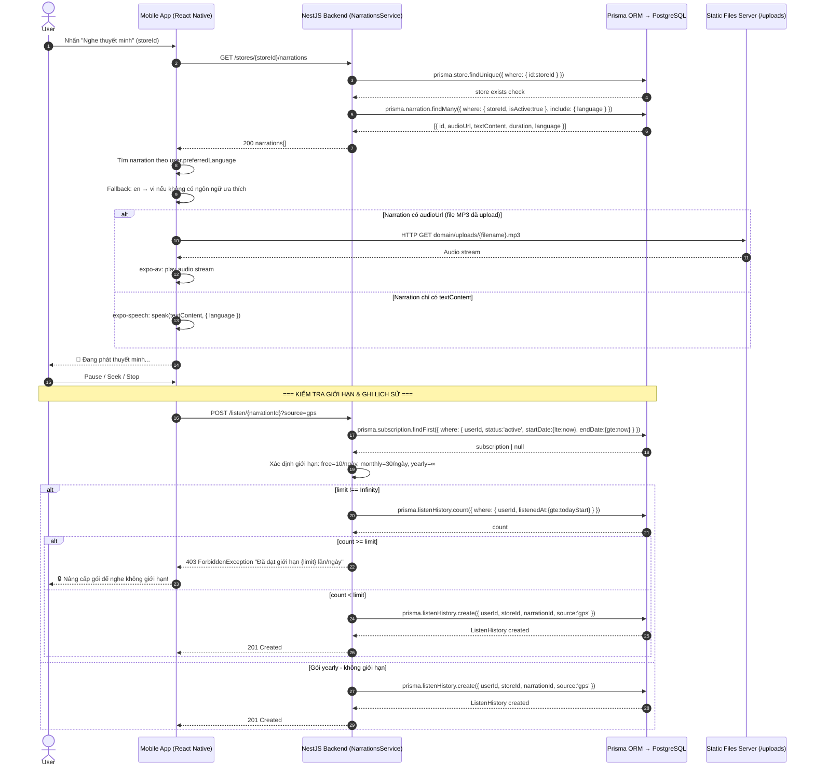
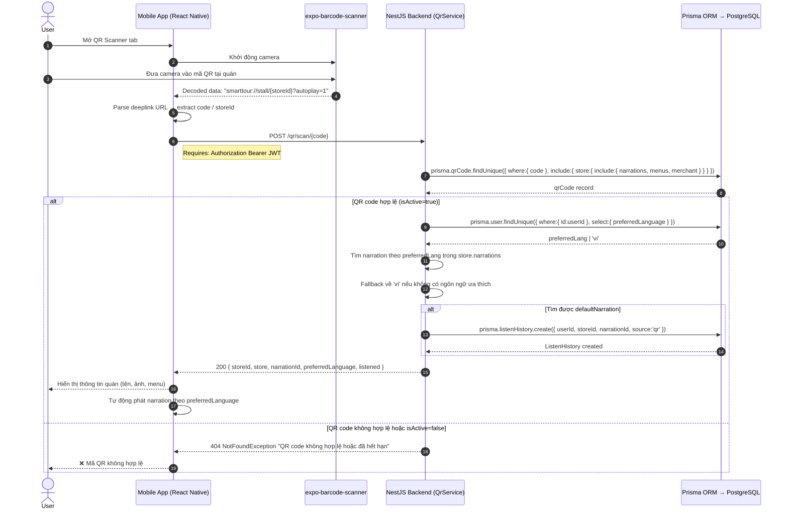
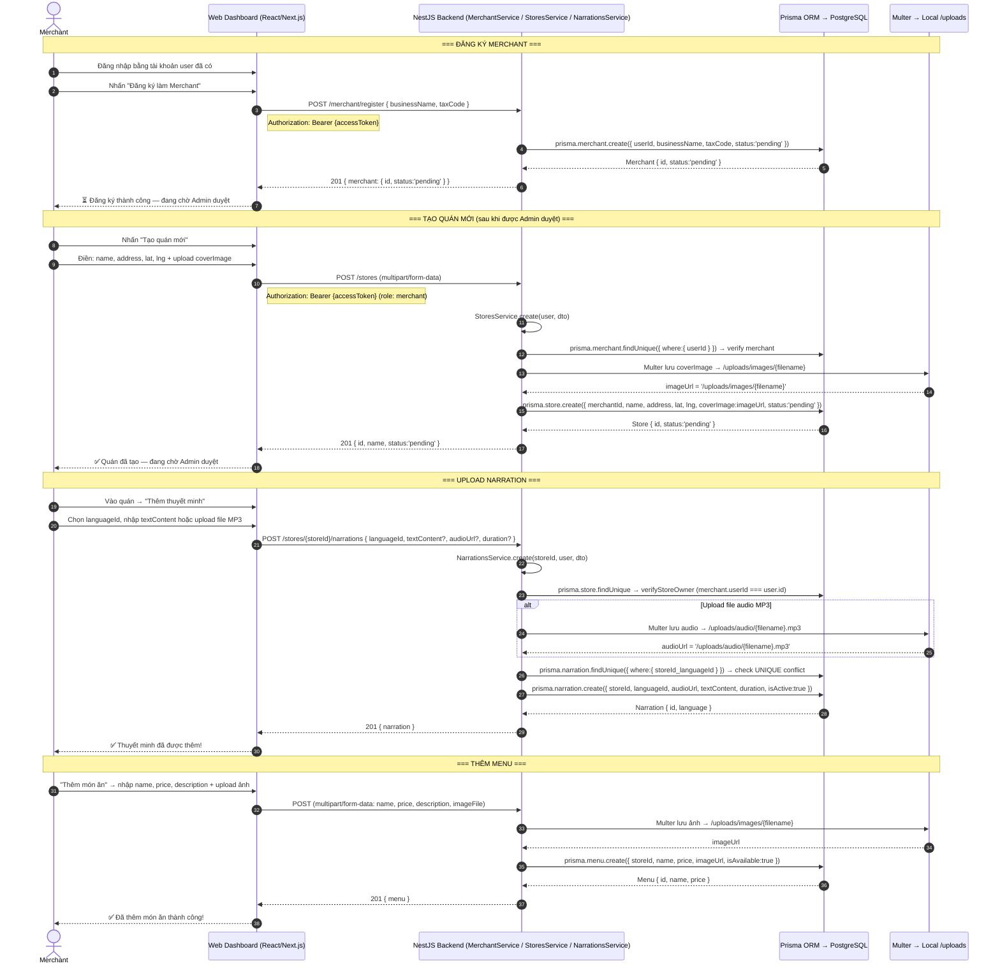
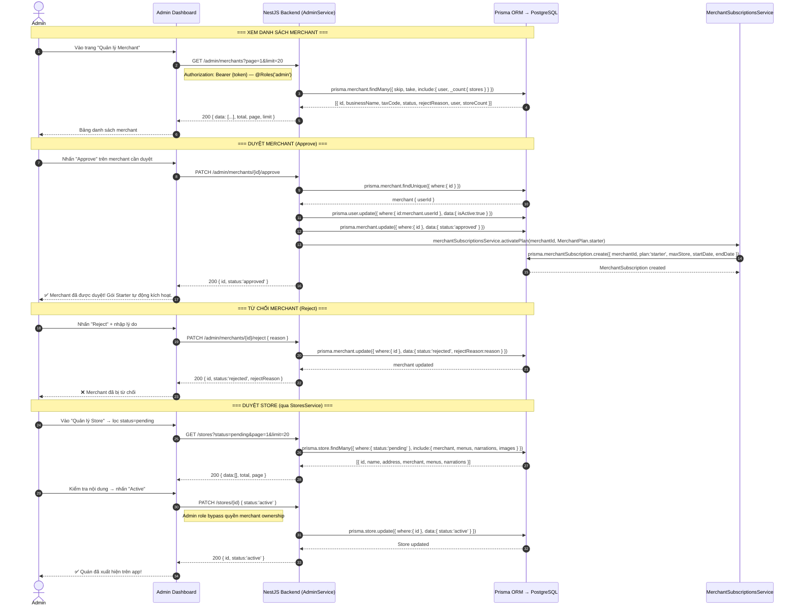
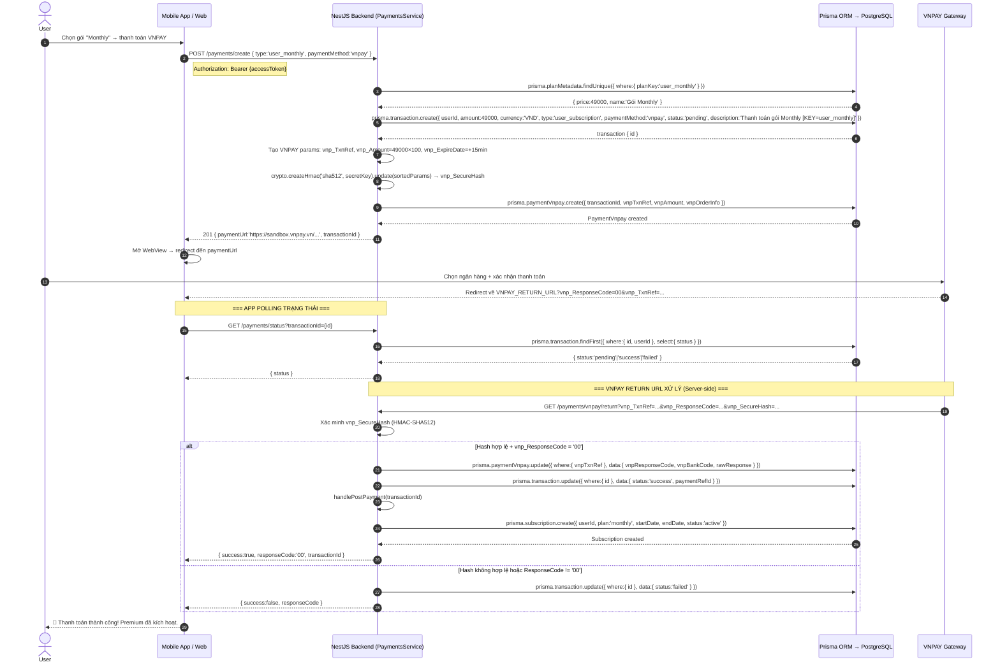
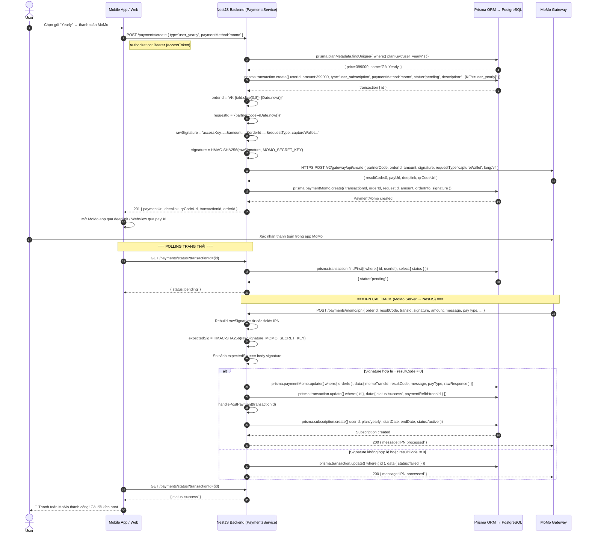
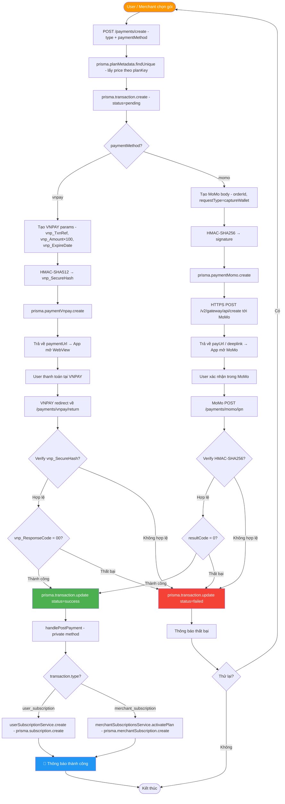

# 📐 SEQUENCE DIAGRAM & ACTIVITY DIAGRAM
# VĨNH KHÁNH DIGITAL AUDIO GUIDE

**Ngày cập nhật:** 18/04/2026  
**Công cụ vẽ:** Mermaid.js

---

## MỤC LỤC

### Sequence Diagrams
1. [SD1 — Đăng ký & Đăng nhập](#sd1--đăng-ký--đăng-nhập)
2. [SD2 — Tìm quán gần đó (GPS + Haversine)](#sd2--tìm-quán-gần-đó-gps--haversine)
3. [SD3 — Nghe Audio Narration](#sd3--nghe-audio-narration)
4. [SD4 — Quét QR Code](#sd4--quét-qr-code)
5. [SD5 — Merchant tạo quán & Upload Narration](#sd5--merchant-tạo-quán--upload-narration)
6. [SD6 — Admin duyệt Merchant](#sd6--admin-duyệt-merchant)
7. [SD7 — Thanh toán VNPAY](#sd7--thanh-toán-vnpay)
8. [SD8 — Thanh toán MoMo](#sd8--thanh-toán-momo)

### Activity Diagrams
1. [AD1 — Luồng User khám phá quán](#ad1--luồng-user-khám-phá-quán)
2. [AD2 — Luồng Merchant đăng ký & tạo quán](#ad2--luồng-merchant-đăng-ký--tạo-quán)
3. [AD3 — Luồng Admin duyệt](#ad3--luồng-admin-duyệt)
4. [AD4 — Luồng thanh toán tổng quát](#ad4--luồng-thanh-toán-tổng-quát)
5. [AD5 — Luồng Narration Fallback đa ngôn ngữ](#ad5--luồng-narration-fallback-đa-ngôn-ngữ)

---

## SEQUENCE DIAGRAMS

> **Lưu ý kiến trúc:** Backend sử dụng **NestJS + Prisma ORM + Dependency Injection**.
> Mọi thao tác DB đều qua `PrismaService` được inject, không có raw SQL trực tiếp.
> Ký hiệu `DB` trong diagram thể hiện lớp Prisma ORM → PostgreSQL.

---

### SD1 — Đăng ký & Đăng nhập



---

### SD2 — Tìm quán gần đó (GPS + Haversine)



---

### SD3 — Nghe Audio Narration



---

### SD4 — Quét QR Code



---

### SD5 — Merchant tạo quán & Upload Narration



---

### SD6 — Admin duyệt Merchant



---

### SD7 — Thanh toán VNPAY



---

### SD8 — Thanh toán MoMo



---

## ACTIVITY DIAGRAMS

---

### AD1 — Luồng User khám phá quán

```mermaid
flowchart TD
    A([🧳 User mở app]) --> B{Đã đăng nhập?}

    B -->|Chưa| C[POST /auth/login hoặc /auth/register]
    C --> D[Chọn ngôn ngữ yêu thích - preferredLanguage]
    D --> E[Yêu cầu quyền GPS]

    B -->|Rồi| E

    E --> F{GPS khả dụng?}

    F -->|Có| G[expo-location watchPositionAsync]
    G --> H[GET /stores/nearby?lat=...&lng=...&radius=5]
    H --> I[StoresService: Haversine filter server-side]
    I --> J[Hiển thị markers trên MapView]

    F -->|Không| K[Hiển thị nút Quét QR Code]
    K --> L[Mở expo-barcode-scanner]
    L --> M[Scan QR tại quán]
    M --> N{QR hợp lệ?}
    N -->|Có| O[POST /qr/scan/{code} — QrService.scanQr]
    N -->|Không| P[❌ 404 NotFoundException]
    P --> L

    J --> Q{Khoảng cách store <= 100m?}

    Q -->|Chưa| R[User tiếp tục di chuyển]
    R --> G

    Q -->|Có| S[GET /nearby?lat=...&lng=...&lang=preferredLang]
    S --> T{Cache hit: narration tồn tại?}
    T -->|Có - dùng cache| U[Trả về textContent đã dịch sẵn]
    T -->|Cache miss - dịch mới| V[MyMemory API vi → targetLang]
    V --> V2[prisma.narration.create - lưu cache]
    V2 --> U
    T -->|Không có bản gốc vi| W[❌ Chưa có nội dung thuyết minh]

    U --> X[📍 Popup Bạn đang gần tên quán]
    X --> Y{User chọn?}

    Y -->|Nghe thuyết minh| Z[GET /stores/{storeId}/narrations]
    Z --> AA{Narration có audioUrl?}
    AA -->|File MP3| AB[expo-av play audio]
    AA -->|Chỉ textContent| AC[expo-speech TTS]
    AB --> AD[POST /listen/{narrationId}?source=gps]
    AC --> AD
    AD --> AE{Subscription check}
    AE -->|free: < 10 hoặc monthly: < 30 hoặc yearly: ∞| AF[prisma.listenHistory.create]
    AE -->|Hết giới hạn| AG[403 Forbidden - Nâng cấp gói]
    AF --> AH([✅ Đã ghi lịch sử nghe])

    Y -->|Xem menu| AI[GET /stores/{storeId} - include menus]
    AI --> AJ[Hiển thị danh sách món ăn + giá]
    Y -->|Bỏ qua| R

    O --> Z

    style A fill:#4CAF50,color:#fff
    style AH fill:#4CAF50,color:#fff
    style X fill:#FF9800,color:#fff
    style AB fill:#2196F3,color:#fff
    style P fill:#f44336,color:#fff
    style W fill:#f44336,color:#fff
    style AG fill:#f44336,color:#fff
```

---

### AD2 — Luồng Merchant đăng ký & tạo quán

```mermaid
flowchart TD
    A([🍜 Merchant truy cập Web Dashboard]) --> B{Có tài khoản?}

    B -->|Chưa| C[POST /auth/register - role=user]
    C --> D[Đăng nhập]
    D --> E

    B -->|Có| E[POST /merchant/register - businessName, taxCode]
    E --> F[prisma.merchant.create - status=pending, user.isActive=false]
    F --> G[⏳ Chờ Admin duyệt]

    G -->|Admin PATCH /admin/merchants/{id}/approve| H[prisma.merchant.update - status=approved\nprisma.user.update - isActive=true\nmerchantSubscriptions.activatePlan - starter]
    H --> I[✅ Merchant Dashboard mở khóa]

    G -->|Admin PATCH /admin/merchants/{id}/reject| J[❌ merchant.rejectReason hiển thị]
    J --> K{Đăng ký lại?}
    K -->|Có| E
    K -->|Không| L([Kết thúc])

    I --> M{Chọn chức năng?}

    M -->|Tạo quán mới| N[Nhập name, address, lat, lng + upload coverImage]
    N --> O[POST /stores - StoresService.create]
    O --> P[Multer lưu /uploads + prisma.store.create - status=pending]
    P --> Q[⏳ Chờ Admin PATCH /stores/{id} - status=active]
    Q -->|Active| R[✅ Quán live trên app]

    M -->|Upload Narration| S[POST /stores/{storeId}/narrations]
    S --> T{Có file MP3?}
    T -->|Có| U[Multer lưu /uploads/audio/]
    T -->|Không| V[Chỉ nhập textContent - TTS phía client]
    U --> W[prisma.narration.create - UNIQUE storeId+languageId]
    V --> W

    M -->|Quản lý Menu| X[POST/PATCH/DELETE menus - prisma.menu.create]
    M -->|Tạo QR Code| Y[POST /qr/store/{storeId} - vô hiệu hóa QR cũ trước]
    M -->|Xem lịch sử| Z[Xem listen_history của quán mình]

    R --> AA([✅ Setup hoàn tất])

    style A fill:#FF9800,color:#fff
    style I fill:#4CAF50,color:#fff
    style R fill:#4CAF50,color:#fff
    style J fill:#f44336,color:#fff
    style G fill:#FFC107,color:#333
```

---

### AD3 — Luồng Admin duyệt

```mermaid
flowchart TD
    A([🛡️ Admin đăng nhập]) --> B[Vào Admin Dashboard]
    B --> C{Chọn chức năng?}

    C -->|Merchant| D[GET /admin/merchants - AdminService.getAllMerchants]
    D --> E[prisma.merchant.findMany include user + _count.stores]
    E --> F[Hiển thị: businessName, taxCode, status, storeCount]
    F --> G{Quyết định?}

    G -->|Approve| H[PATCH /admin/merchants/{id}/approve]
    H --> H1[prisma.user.update isActive=true]
    H1 --> H2[prisma.merchant.update status=approved]
    H2 --> H3[merchantSubscriptionsService.activatePlan - MerchantPlan.starter]
    H3 --> I[✅ Merchant kích hoạt + auto gói Starter]

    G -->|Reject| J[PATCH /admin/merchants/{id}/reject - body.reason]
    J --> J1[prisma.merchant.update status=rejected + rejectReason]
    J1 --> K[❌ Merchant bị từ chối]

    C -->|Store| L[GET /stores?status=pending - StoresService.findAll]
    L --> M[Kiểm tra: ảnh, menu, narrations]
    M --> N{Nội dung OK?}

    N -->|Đủ & hợp lệ| O[PATCH /stores/{id} data.status=active]
    O --> O1[prisma.store.update status=active]
    O1 --> P[✅ Quán xuất hiện trên app]

    N -->|Vi phạm hoặc thiếu| Q[PATCH /stores/{id} data.status=hidden]
    Q --> Q1[prisma.store.update status=hidden]
    Q1 --> R[Liên hệ Merchant chỉnh sửa]

    C -->|Người dùng| S[GET /admin/users - AdminService.getAllUsers]
    S --> T[PATCH /admin/users/{id}/toggle-active]
    T --> T1[prisma.user.update isActive=!isActive]
    T1 --> U[Bật/tắt tài khoản]

    C -->|Thống kê| V[GET /admin/stats - AdminService.getStats]
    V --> W[📊 userCount, merchantCount, storeCount, totalRevenue\nmonthlyRevenue chart, topPOI, topMerchant, topClient]

    C -->|Lịch sử giao dịch| X[GET /payments/history]
    X --> Y[Xem transactions: status, amount, paymentMethod, MoMo/VNPAY detail]

    style A fill:#9C27B0,color:#fff
    style P fill:#4CAF50,color:#fff
    style I fill:#4CAF50,color:#fff
    style K fill:#f44336,color:#fff
    style Q fill:#f44336,color:#fff
```

---

### AD4 — Luồng thanh toán tổng quát



---

### AD5 — Luồng Narration Fallback đa ngôn ngữ

```mermaid
flowchart TD
    A([User kích hoạt GPS gần quán]) --> B[GET /nearby?lat=...&lng=...&lang=preferredLang]
    B --> C[NarrationsService.findNearby]

    C --> D[prisma.store.findMany - status=active]
    D --> E[Haversine: tìm store trong 100m]

    E --> F{Tìm được store?}
    F -->|Không| G([Không tìm thấy địa điểm trong 100m])

    F -->|Có| H[prisma.language.findUnique - where code=targetLang]
    H --> I{Language hợp lệ?}
    I -->|Không| J([Ngôn ngữ chưa được hỗ trợ])

    I -->|Có| K[prisma.narration.findUnique - where storeId_languageId]
    K --> L{Cache hit?}

    L -->|✅ Có sẵn| M[Trả về textContent đã lưu]

    L -->|❌ Cache miss| N[prisma.narration.findUnique - languageId=vi gốc]
    N --> O{Bản gốc vi tồn tại?}

    O -->|✅ Có| P[translateText via MyMemory API vi→targetLang]
    P --> Q[prisma.narration.create - lưu cache bản dịch mới]
    Q --> M

    O -->|❌ Không có| R([Địa điểm chưa có thuyết minh gốc tiếng Việt])

    M --> S[Response found=true storeName textContent distance]
    S --> T[App nhận textContent → expo-speech TTS đọc]
    T --> U[POST /listen/{narrationId}?source=gps]
    U --> V[NarrationsService.recordListen]
    V --> W{Subscription limit check}
    W -->|OK| X[prisma.listenHistory.create]
    X --> Y([✅ Ghi lịch sử thành công])
    W -->|Hết quota| Z([403 ForbiddenException])

    R --> AA([Gợi ý: Quét QR hoặc xem menu])
    G --> AA

    style A fill:#2196F3,color:#fff
    style M fill:#4CAF50,color:#fff
    style Q fill:#4CAF50,color:#fff
    style Y fill:#4CAF50,color:#fff
    style R fill:#f44336,color:#fff
    style J fill:#f44336,color:#fff
    style Z fill:#f44336,color:#fff
    style T fill:#9C27B0,color:#fff
```

---

## TỔNG HỢP DIAGRAMS

| Loại | Mã | Mô tả | Actor chính |
|------|-----|-------|-------------|
| Sequence | SD1 | Đăng ký & Đăng nhập — JWT Cookie + bcrypt | User / Merchant |
| Sequence | SD2 | GPS Geofencing — Haversine + MyMemory Auto-translate | User + API |
| Sequence | SD3 | Nghe Audio — expo-av/expo-speech + Subscription Limit | User |
| Sequence | SD4 | Quét QR — QrService.scanQr + Auto Listen History | User + Camera |
| Sequence | SD5 | Merchant setup — Multer upload + Prisma store/narration | Merchant |
| Sequence | SD6 | Admin duyệt — approve/reject + Auto Starter Plan | Admin |
| Sequence | SD7 | Thanh toán VNPAY — HMAC-SHA512 + Return URL | User + VNPAY |
| Sequence | SD8 | Thanh toán MoMo — HMAC-SHA256 + IPN Callback | User + MoMo |
| Activity | AD1 | Khám phá quán — GPS → Map → Narration → Listen | User |
| Activity | AD2 | Merchant setup — register → store → narration → QR | Merchant |
| Activity | AD3 | Admin quản lý — merchant/store/user/stats/transactions | Admin |
| Activity | AD4 | Thanh toán tổng quát — VNPAY & MoMo unified flow | User / Merchant |
| Activity | AD5 | Narration multilingual — cache hit/miss + auto-translate | System |

---

*Tài liệu này được duy trì bởi nhóm phát triển dự án Seminar SGU.*  
*Cập nhật lần cuối: 18/04/2026*
