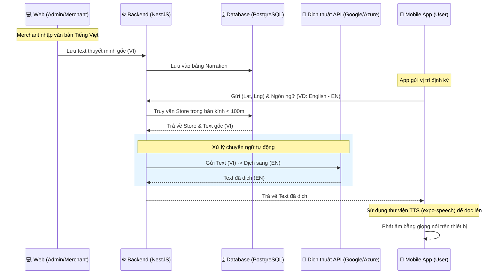

# HƯỚNG DẪN THIẾT KẾ & TRIỂN KHAI CHỨC NĂNG THUYẾT MINH (NARRATION)

Tài liệu này trình bày giải pháp toàn diện cho chức năng thuyết minh tự động khi người tham quan di chuyển gần các quán ăn (POI).

---

## 1. TỔNG QUAN QUY TRÌNH (WORKFLOW)

Tính năng hoạt động dựa trên sự phối hợp giữa ba phân hệ: **Web Quản trị**, **Backend Xử lý**, và **Mobile App**.



---

## 2. GIAO DIỆN WEB (QUẢN LÝ NỘI DUNG)

Để tối giản hóa cho người dùng (Chủ quán), giao diện đã được thiết kế lại như sau:

### A. Cho Chủ quán (Merchant UI)
*   **Chỉ giữ lại 2 trường thông tin chính**:
    1.  **Chọn quán ăn**: Dropdown danh sách các quán thuộc quyền sở hữu.
    2.  **Đoạn nội dung thuyết minh**: Textarea để nhập câu chuyện hoặc thông tin (Yêu cầu nhập bằng **Tiếng Việt**).
*   **Tự động hóa**: Hệ thống sẽ tự gán mã ngôn ngữ là `vi`, ẩn hoàn toàn các trường Audio URL và Thời lượng.

### B. Cho Quản trị viên (Admin UI)
*   **Hiển thị danh sách**:
    *   **Tên quán ăn**: Để Admin biết nội dung thuộc về cơ sở nào.
    *   **Nội dung văn bản (VI)**: Hiển thị đoạn văn bản thuyết minh gốc.
    *   **Trạng thái**: Cho phép Admin duyệt (Active) hoặc ẩn (Hidden).

---

## 3. LOGIC BACKEND (XỬ LÝ TRUNG TÂM)

### A. Xác định vị trí (Geofencing)
Backend cung cấp 1 API endpoint: `GET /api/narrations/nearby?lat=...&lng=...&lang=...`
1.  **Thuật toán**: Tính khoảng cách giữa (Lat, Lng) của User và (Lat, Lng) của tất cả Stores.
2.  **Bộ lọc**: Lấy Store có khoảng cách $\le 100m$ và có `isActive: true`.

### B. Dịch thuật tự động (Translation)
Sau khi tìm thấy Store, Backend kiểm tra:
*   Nếu ngôn ngữ App yêu cầu là tiếng Việt (`vi`): Trả về text gốc.
*   Nếu là ngôn ngữ khác (`en`, `ja`, `zh`...):
    1.  Gọi API dịch thuật (ví dụ: Google Cloud Translation).
    2.  Trả về kết quả dịch cho App.
    3.  *(Mở rộng)*: Có thể cache lại bản dịch vào DB để dùng cho các User sau, tiết kiệm chi phí gọi API.

---

## 4. GIỌNG ĐỌC PHÍA FRONTEND (MOBILE APP)

Giọng đọc được hiện thực hóa bằng công nghệ **TTS (Text-to-Speech)** trên thiết bị di động.

### A. Công nghệ sử dụng
*   **Thư viện**: `expo-speech` (Sử dụng API giọng đọc hệ điều hành của iOS/Android).
*   **Ưu điểm**: Giọng đọc tự nhiên, hỗ trợ hàng chục ngôn ngữ mà không cần tải file âm thanh nặng.

### B. Mã ví dụ (React Native/Expo)
Cài đặt: `npx expo install expo-speech`

```javascript
import * as Speech from 'expo-speech';

/**
 * Hàm đọc văn bản nhận được từ Backend
 * @param {string} text - Nội dung backend trả về
 * @param {string} lang - Mã ngôn ngữ (VD: 'en-US', 'vi-VN')
 */
const playNarration = (text, lang) => {
    // Kiểm tra và dừng giọng nói cũ nếu đang phát
    Speech.stop(); 
    
    // Phát giọng nói mới
    Speech.speak(text, {
        language: lang, // Hệ điều hành sẽ tự chọn "Giọng đọc" phù hợp
        pitch: 1.0,
        rate: 0.9,     // Đọc chậm lại một chút để dễ nghe hơn
    });
};
```

---

## 5. KẾ HOẠCH TIẾP THEO
1.  **Hoàn thành UI**: (Đã cập nhật giao diện `AudioManagement.tsx`).
2.  **Xây dựng API Backend**: Implement logic tính toán khoảng cách 100m.
3.  **Hợp nhất Dịch thuật**: Cấu hình API Key cho dịch vụ Google Translate trong Backend.
4.  **Tích hợp App**: Cập nhật logic theo dõi GPS và gọi hàm `Speech.speak`.
