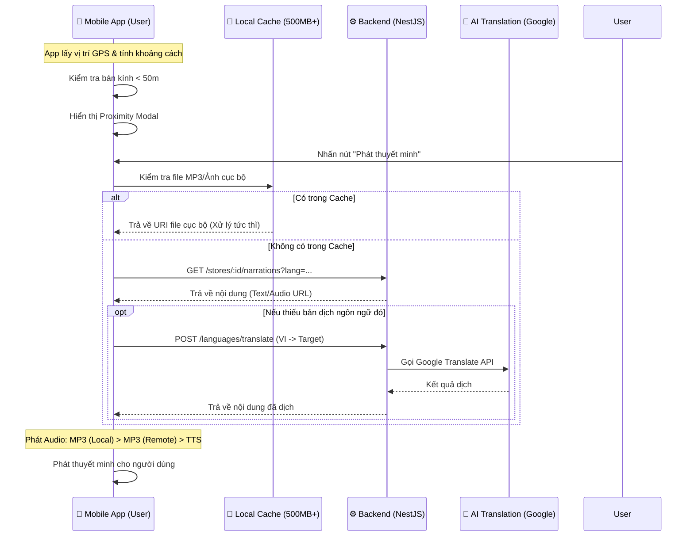

# HƯỚNG DẪN THIẾT KẾ & TRIỂN KHAI CHỨC NĂNG THUYẾT MINH (NARRATION v2.0)

Tài liệu này trình bày giải pháp toàn diện cho chức năng thuyết minh tự động và thông minh, kết hợp giữa lưu trữ offline và dịch thuật AI tức thời.

---

## 1. TỔNG QUAN QUY TRÌNH (WORKFLOW)

Tính năng hoạt động dựa trên sự phối hợp giữa **Mobile App (Xử lý logic chính)** và **Backend (Cung cấp dữ liệu & Dịch thuật)**.



---

## 2. CHẾ ĐỘ PHÁT AUDIO (MEDIA STRATEGY)

Để tối ưu trải nghiệm, App sử dụng chiến lược 3 lớp:

1.  **Lớp 1: MP3 Offline (Ưu tiên cao nhất)**: Sử dụng `expo-file-system` để đọc file từ thư mục `offline_cache`. Không tốn băng thông, tải cực nhanh.
2.  **Lớp 2: MP3 Online**: Nếu chưa tải về máy nhưng DB đã có sẵn file Audio (Merchant upload), App sẽ stream trực tiếp từ URL.
3.  **Lớp 3: TTS (Text-to-Speech)**: Nếu không có file Audio, App dùng `expo-speech` để đọc đoạn văn bản (đã dịch) lên cho khách nghe.

---

## 3. LOGIC XỬ LÝ TRÊN MOBILE (FRONTEND)

### A. Xác định vị trí (Geofencing tại Client)
Hệ thống không còn gọi API liên tục để check khoảng cách. Thay vào đó:
1.  **Thuật toán**: Sử dụng công thức `Haversine` để tính khoảng cách giữa User và danh sách quán đã tải về từ trước.
2.  **Bộ lọc**: Kích hoạt Modal khi khoảng cách $\le 50m$.

### B. Đồng bộ Offline (Intelligent Sync)
Tự động đồng bộ tài nguyên (Ảnh bìa + Audio ngôn ngữ chính) khi:
-   **Đăng nhập thành công**.
-   **Khởi động App** (nếu đã login).
-   **Điều kiện**: Dung lượng trống thiết bị $> 500MB$.

---

## 4. DỊCH THUẬT TỰ ĐỘNG (BACKEND & AI)

Khi User yêu cầu một ngôn ngữ chưa được Merchant chuẩn bị sẵn:
1.  **Trigger**: Frontend gọi API `POST /languages/translate`.
2.  **Xử lý**: Backend dịch nội dung Tiếng Việt gốc sang ngôn ngữ mục tiêu.
3.  **Lưu trữ**: Bản dịch được lưu lại vào Database để sử dụng cho các lần sau (tiết kiệm chi phí AI).

---

## 5. MÃ NGUỒN THAM KHẢO

Cấu trúc logic chính tại:
-   `frontend/app/services/OfflineService.ts`: Quản lý Cache & Storage.
-   `frontend/app/app/(tabs)/map/index.tsx`: Xử lý GPS & 50m Alert.
-   `frontend/app/app/stall/[id].tsx`: Xử lý logic Phát Media 3 lớp.

---
*Cập nhật lần cuối: 14/04/2026 bởi Đội ngũ Phát triển.*
và dừng giọng nói cũ nếu đang phát
    Speech.stop(); 
    
    // Phát giọng nói mới
    Speech.speak(text, {
        language: lang, // Hệ điều hành sẽ tự chọn "Giọng đọc" phù hợp
        pitch: 1.0,
        rate: 0.9,     // Đọc chậm lại một chút để dễ nghe hơn
    });
};
```

---

## 5. KẾ HOẠCH TIẾP THEO
1.  **Hoàn thành UI**: (Đã cập nhật giao diện `AudioManagement.tsx`).
2.  **Xây dựng API Backend**: Implement logic tính toán khoảng cách 100m.
3.  **Hợp nhất Dịch thuật**: Cấu hình API Key cho dịch vụ Google Translate trong Backend.
4.  **Tích hợp App**: Cập nhật logic theo dõi GPS và gọi hàm `Speech.speak`.
