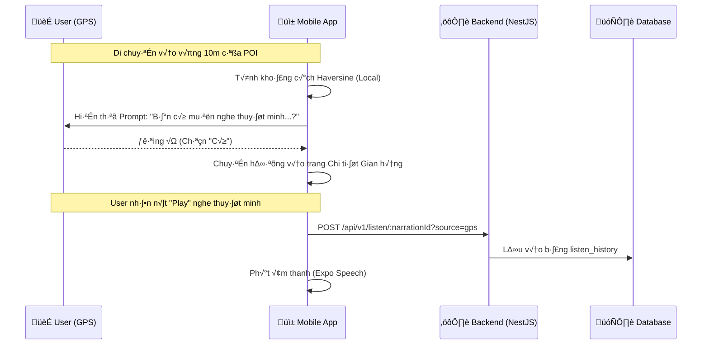

# HƯỚNG DẪN THIẾT KẾ & TRIỂN KHAI CHỨC NĂNG THUYẾT MINH (NARRATION)

Tài liệu này trình bày giải pháp toàn diện cho chức năng thuyết minh tự động khi người tham quan di ## 1. TỔNG QUAN QUY TRÌNH (WORKFLOW)

Tính năng hoạt động dựa trên sự phối hợp giữa **Vị trí GPS**, **Logic 10m Geofencing (Client-side)**, và **Hệ thống Ghi nhận Lịch sử**.



---

## 2. CHẾ ĐỘ NHẬN DIỆN KHÔNG GIAN (GEOFENCING)

Thay vì tự động phát âm thanh khi ở xa (100m) có thể gây phiền nhiễu, hệ thống hiện nay áp dụng các quy tắc sau:

### A. Độ chính xác 10 mét
*   **Haversine Algorithm**: App tính toán khoảng cách trực tiếp trên thiết bị (Client-side) giữa tọa độ GPS của người dùng và tọa độ của tất cả gian hàng đã tải về.
*   **Bán kính**: Chỉ kích hoạt khi khoảng cách $\le 10m$.
*   **Ưu tiên**: Nếu có nhiều POI trong cùng 10m, hệ thống luôn chọn POI có khoảng cách **ngắn nhất**.

### B. Cơ chế Chống Spam (Anti-Spam)
*   Mỗi gian hàng chỉ hiển thị thông báo hỏi (Prompt) **một lần duy nhất** trong suốt phiên bản bản đồ đó.
*   Thông tin được lưu vết qua `promptedStoresRef` để đảm bảo người dùng không bị hỏi đi hỏi lại khi đứng cạnh một quán ăn lâu.

---

## 3. LỊCH SỬ NGHE VÀ TRUY XUẤT (LISTEN HISTORY)

### A. Ghi nhận thời điểm nghe
*   Hệ thống không ghi nhận khi chỉ vừa mới "đi ngang qua".
*   Lịch sử chỉ được tạo khi người dùng thực sự nhấn nút **Phát (Play)** đoạn thuyết minh trong trang chi tiết.
*   Endpoint: `POST /api/v1/listen/:narrationId?source=gps`

### B. Hiển thị Lịch sử (Visited Stalls History)
*   Người dùng có thể xem lại danh sách các quán đã từng nghe thuyết minh tại mục **Profile > Visited Stalls History**.
*   Dữ liệu bao gồm: Hình ảnh quán, Tên quán, Địa chỉ, Thời gian nghe, và Ngôn ngữ đã sử dụng.

---

## 4. GIỌNG ĐỌC PHÍA FRONTEND (MOBILE APP)

Giọng đọc sử dụng công nghệ **TTS (Text-to-Speech)** nội bộ của thiết bị.

### A. Công nghệ & Bản đồ ngôn ngữ
*   **Thư viện**: `expo-speech`.
*   **Ánh xạ ngôn ngữ**: Hệ thống tự động map mã code ngôn ngữ (vi, en, ko...) sang locale tương ứng của thiết bị (vi-VN, en-US, ko-KR...) để gọi giọng đọc chuẩn nhất.

### B. Mã ví dụ ghi nhận lịch sử (Frontend)
```javascript
// Khi nhấn nút Play
const handlePlay = async (narrationId) => {
    // 1. Ghi nhận vào DB
    await api.post(`/listen/${narrationId}?source=gps`);
    
    // 2. Ph√°t √¢m thanh
    Speech.speak(textContent, { language: 'vi-VN' });
};
```
† d·ª´ng gi·ªçng n√≥i c≈© n·∫øu ƒëang ph√°t
    Speech.stop(); 
    
    // Phát giọng nói mới
    Speech.speak(text, {
        language: lang, // Hệ điều hành sẽ tự chọn "Giọng đọc" phù hợp
        pitch: 1.0,
        rate: 0.9,     // Đọc chậm lại một chút để dễ nghe hơn
    });
};
```

---

## 5. KẾ HOẠCH TIẾP THEO
1.  **Hoàn thành UI**: (Đã cập nhật giao diện `AudioManagement.tsx`).
2.  **Xây dựng API Backend**: Implement logic tính toán khoảng cách 100m.
3.  **Hợp nhất Dịch thuật**: Cấu hình API Key cho dịch vụ Google Translate trong Backend.
4.  **Tích hợp App**: Cập nhật logic theo dõi GPS và gọi hàm `Speech.speak`.
